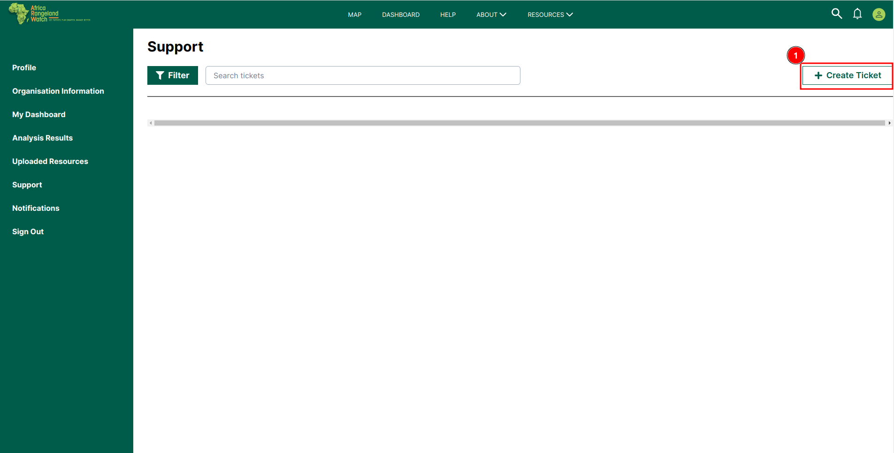

# Support Page: Africa RangeLand Watch (ARW)

To access the support page of the ARW you have to click on the 1️⃣ `Support` tab on the left menu bar.

## How to Create Ticket?

By clicking the 1️⃣ `Create Ticket` button, you will be redirected to a new page where you can provide the necessary details to create a new ticket.

This is the interface of the `Create Ticket` page. To create a new ticket, start by selecting the 1️⃣ `Issue Type` (e.g., Bug, Feature Request) from the drop-down menu. Next, enter the 2️⃣ `Issue Title` to describe the issue. If needed, you can upload relevant files in the 3️⃣ `Upload Attachments` section. Provide more context by filling out the 4️⃣ `Additional Details` field. Once all the information is complete, click on the 6️⃣ `Submit button` to create the ticket, or select 5️⃣ `Cancel` to cancel the request.

## How to Upload Attachments?

## How to Filter Tickets?

## How to use Search?

