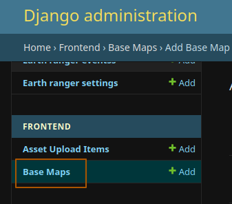
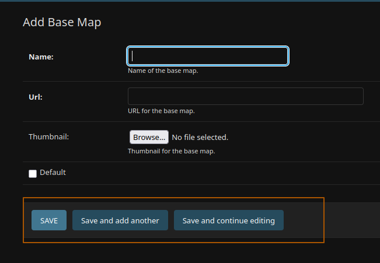

# Administrator guide

This guide provides instructions for administrators on how to manage and configure the Africa Rangeland Watch platform.

## Managing Base Maps

Base maps provide the background map layers that users see in the application. As an administrator, you can add, edit, and manage base maps through the Django admin interface.

### Adding a New Base Map

Follow these steps to add a new base map to the platform:

1. **Access the Base Maps Section**
   - Log in to the Django admin interface
   - In the left sidebar, locate and click on **"Base Maps"** under the Frontend section

2. **Create a New Base Map**
   - Click the **"Add Base Map"** button in the top right corner

3. **Fill in the Required Fields**
   - **Name**: Enter a descriptive name for the base map (e.g., "OpenStreetMap", "Satellite Imagery")
   - **URL**: Enter the tile server URL for the base map
     - Format: `https://example.com/{z}/{x}/{y}.png`
     - The URL should include `{z}`, `{x}`, and `{y}` placeholders for zoom level and tile coordinates
   - **Thumbnail** (optional): Upload a preview image that represents the base map
     - This helps users identify the base map visually
     - Recommended size: 200x200 pixels or similar square format
   - **Default**: Check this box if you want this base map to be the default selection
     - **Note**: Only one base map can be set as default at a time. If you check this box, any previously default base map will automatically be unmarked.

4. **Save the Base Map**
   - Click the **"Save"** button at the bottom of the form
   - The base map will be immediately available in the frontend

5. **Verify on Frontend**
   - Navigate to the main map interface
   - Open the base map selector on the bottom left
   - Your new base map should appear in the list and be selectable by users

### Common Base Map Tile Servers

Here are some popular tile server URLs you can use:

- **OpenStreetMap**: `https://tile.openstreetmap.org/{z}/{x}/{y}.png`
- **EOX Sentinel-2 Cloudless**: `https://tiles.maps.eox.at/wmts/1.0.0/s2cloudless_3857/default/g/{z}/{y}/{x}.jpg`

### Tips and Best Practices

- Always test the tile server URL before adding it to ensure it works correctly
- Use descriptive names that clearly indicate what the base map shows
- Upload thumbnails for all base maps to improve user experience
- Only set one base map as default to avoid confusion
- Ensure tile server URLs are from reliable sources with good uptime
