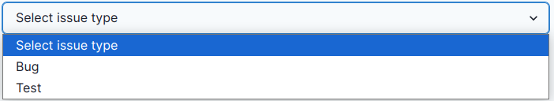

# Support Page: Africa RangeLand Watch (ARW)

1. **Support:** Click on this tab to access the support page of the ARW.

2. **Filter:** The filter feature enables users to organise tickets based on their preferences, making it easier to sort and view specific types of tickets.

3. **Search:** Allows users to search tickets.

4. **Create Ticket:** This button enables users to create a new ticket. By clicking on the Create Ticket button, a new form will appear.

    

    **1. Issue:** Allows users to select issue from the drop down menu.

    

    **2. Issue Title:** This input field enables users to provide descriptive title for their issue.        

    **3. Upload Attachments (Optional):** If user wants to provide any attachments about the issue, they can upload them here.

    * This feature is optional.

        

        **1. Click on this input field to select the file to be uploaded.**

        

        * **Cancel:** Cancels the file upload process.

        * **Select:** After choosing the desired file users have to click on the `Select` button to complete the process.

        * **Image Files:** Type of files.

        * **✅ Checkbox:** Checking this box will allow users to open file in read only mode.

        * After completing the process image will be added to the attachments.

            

            **1. Remove:** Click on the `Remove` button to remove the attached file.

    **4. Additional Details:** This input field enables users to provide additional details about the issue.

    **5. Cancel:** Cancels the ticket creation process.

    **6. Submit:** Submits the ticket.
    
