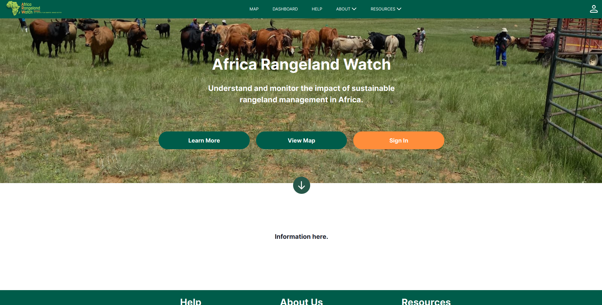

# Welcome to the Africa Rangeland Watch (ARW) Documentation Site

 <!-- change path to main screenshot, InaSAFE is a good reference -->

## Introduction

Africa Rangeland Watch (ARW) was designed and developed by Conservation International (CI) and is aimed at monitoring rangeland impact. ARW empowers users to quantify land-use and climate impacts on rangelands over time and space, based on remotely sensed satellite imagery supplemented by ground-based rangeland monitoring. Leveraging earth observation technology for tracking conservation impact and improving planning has improved decision making and informed adaptive land-use management.

<!-- Insert introduction paragraphs here -->
<!-- Can also input short video demo of project here (YouTube link, etc) -->
<!-- Can contain Purpose/Why of project and the Scope of Project without use of sub-headings-->

## Key concepts

Welcome to the official documentation site for Africa Rangeland Watch (ARW)—a cutting-edge platform developed by Conservation International (CI) to empower stakeholders in monitoring and managing rangeland impact across Africa.
ARW combines the power of remotely sensed satellite imagery and ground-based rangeland monitoring to provide actionable insights into the effects of land-use and climate change on rangelands. By leveraging advanced earth observation technology, ARW supports improved decision-making and adaptive land-use management to enhance conservation efforts.

About This Documentation

This site is your comprehensive resource for understanding and utilizing ARW. Whether you're a first-time user, an administrator, or a developer, you’ll find the information you need to make the most of the platform. The documentation is divided into three main categories:

1. User Documentation
    
    [User Manual](./user/manual/index.md): A detailed reference covering every button, page, and feature of the ARW platform. Perfect for understanding how each element works.

    [User Guide](./user/guide/index.md): A tutorial-style resource that walks you through how to use ARW effectively. Learn to quantify rangeland impacts and leverage the platform’s capabilities for your conservation goals.

2. Administrator Documentation
    
    Designed for system administrators who manage and maintain the ARW platform. This section covers setup, configuration, and troubleshooting to ensure the platform runs smoothly.

3. Development Documentation

    For developers and technical contributors, this section provides detailed technical documentation on ARW’s architecture, APIs, and integration options.

## Why ARW?

ARW is more than a monitoring tool—it's a game-changer for conservation. By providing spatial and temporal data insights, it enables:

Quantification of rangeland health over time and space.

Improved planning and decision-making for sustainable land management.

Enhanced ability to track conservation impact and adapt strategies accordingly.

Explore the documentation to unlock the full potential of ARW in your conservation initiatives!

### Disclaimer

The software provided by this project is provided 'as is'. All information provided
within the platform should be independently verified before using as the basis for
action. The contributors and developers of this platform take no responsibility
for any loss of revenue, life, physical harm or any other adverse outcome that may
occur as a result of the use of this platform.

### Purpose

### Scope of project

### Project roadmap

[Project Roadmap]()
<!-- Either insert link to roadmap or actual roadmap (Speak to team leads) -->

#### Contributing

We would love to collaborate with you! But first, please read our [contributor
guidelines](about/contributing.md) which describe how to report
issues, plan and contribute feature additions etc.

#### Code of conduct

Our community in this project is aligned with our [Code of
Conduct](about/code-of-conduct.md) - please be sure to read and abide by that
document in all interactions with out community.

#### Diversity statement

This project welcomes and encourages participation by everyone.

No matter how you identify yourself or how others perceive you: we welcome you.
We welcome contributions from everyone as long as they interact constructively
with our community.

While much of the work for our project is technical in nature, we value and
encourage contributions from those with expertise in other areas, and welcome
them into our community.

## Project partners

<!-- Insert Project Partner Logos and/or Links -->

[Project Partner 1]()

#### Releases

<!-- Insert links to release pages, change as needed -->
[GitHub releases page]()
[Releases page]()

| | **Project Badges** | |
| ----------------------- | ----------------------- | ----------------------- |
|  |  |  |
|  |  |  |

#### Project chatroom

<!-- Insert links to chatroom pages if available, otherwise remove -->
[Chatroom]()

#### Contributor License Agreement (CLA)
<!-- Insert links to CLA -->
Contributions to this project will be subject to our [Contributor License Agreement]()

#### License

This project is open source, published under the AGPL-3.
You can read our license to find out what rights this license bestows to users and contributors.

[License](about/license.md)

<!-- Keep the Kartoza Logo at the bottom of the page if the project allows -->

