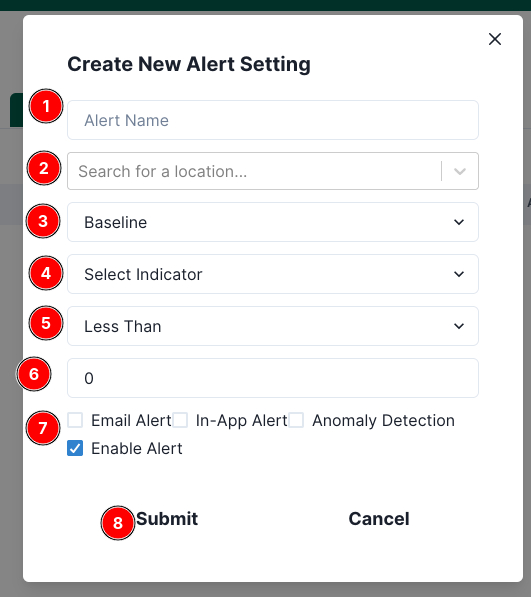

# Alert settings

Access the Alertsettings page from the user profile page. Click on the 1️⃣ `Alertsettings` tab from the left menu bar to access the Earthranger event page.

Click on the 2️⃣ `Settings` icon.

Click **Add Alert Setting** to open the form.

Use the numbered guide on the screenshot:

1️⃣ **Alert Name** — A short, human-readable name shown in notifications and lists.  
2️⃣ **Location** — Search and select the specific location this alert should monitor.  
3️⃣ **Analysis Type** — Choose what you want to monitor (e.g., *Baseline*, *Spatial*, *Temporal*).  
4️⃣ **Indicator** — Pick the indicator to track (e.g., NDVI, EVI).  
5️⃣ **Condition** — Select the threshold operator (e.g., *Less Than*, *Greater Than*, *Equal To*).  
6️⃣ **Threshold Value** — Enter the numeric value to compare against.  
7️⃣ **Options**  
&nbsp;&nbsp;&nbsp;&nbsp;• **Email Alert** — Send an email when the alert triggers.  
&nbsp;&nbsp;&nbsp;&nbsp;• **In-App Alert** — Show it in the Notifications panel.  
&nbsp;&nbsp;&nbsp;&nbsp;• **Anomaly Detection** — Trigger alerts based on anomaly logic (can be used alongside thresholds).  
&nbsp;&nbsp;&nbsp;&nbsp;• **Enable Alert** — Toggle the alert on/off without deleting it.  
8️⃣ **Submit** — Save the alert (or **Cancel** to close without saving).

> **Tip:** You can later edit or disable an alert without deleting it.

Alert settings are grouped by indicators.
To view your specific alert setting, click on `View Alert Settings` button.

You will be able to see your current active alert settings.

