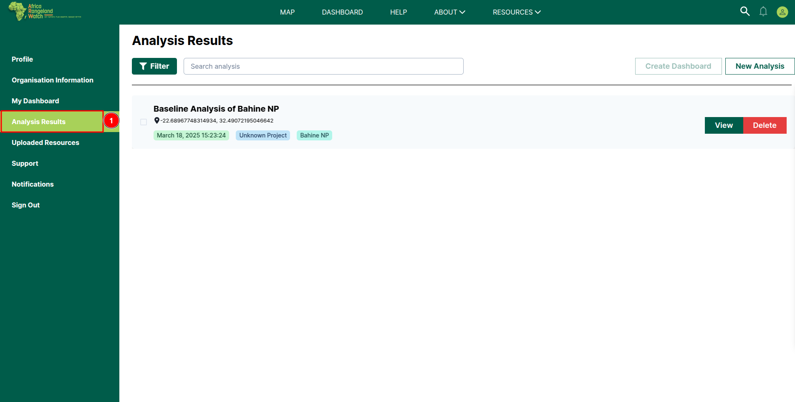
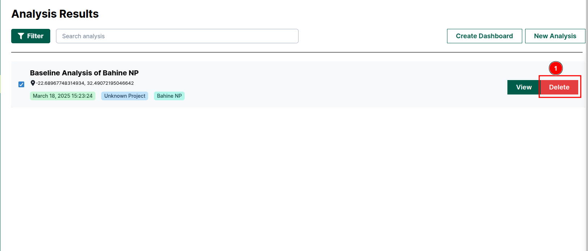
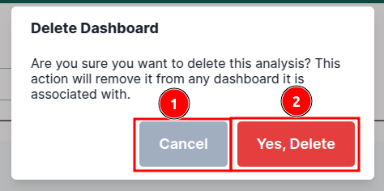
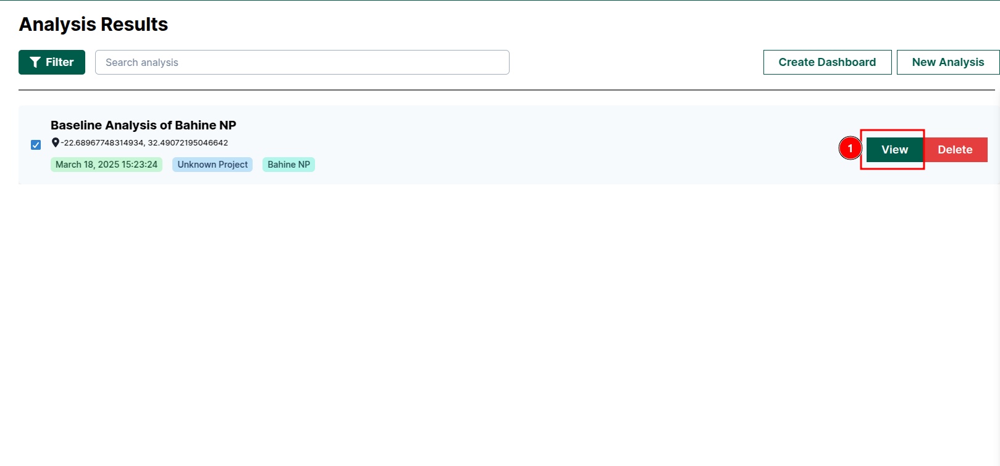
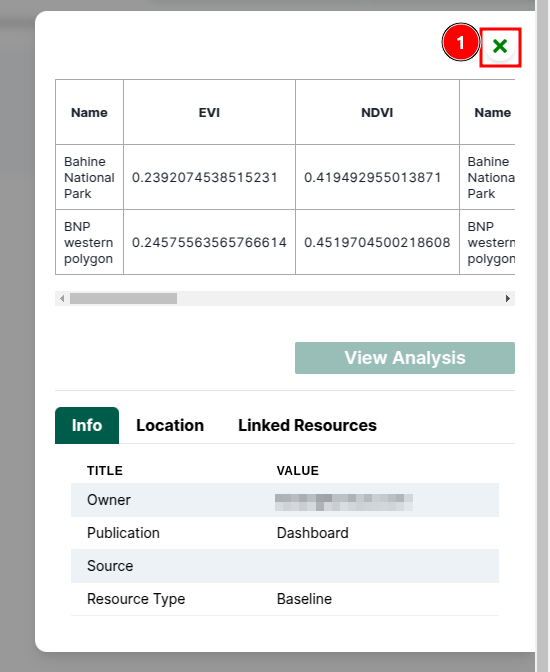

# Analysis Results: Africa RangeLand Watch (ARW)

You access the analysis results page by clicking on the 1️⃣ `Analysis Results` tab from the navigation bar located at the left side of the page.

## How to Delete Analysis?

To delete the analysis click on the 1️⃣ `Delete` button. This will open a confirmation dialog box.

To cancel the process click on the 2️⃣ `Cancel` button. To confirm the deletion click on the 3️⃣ `Yes, Delete` button.

## How to View Analysis Details?

To view the analysis report click on the 1️⃣ `View` button. This will open the analysis report.

The following report contains all the information about the analysis. To close the report click on the 2️⃣ `❎` icon.

