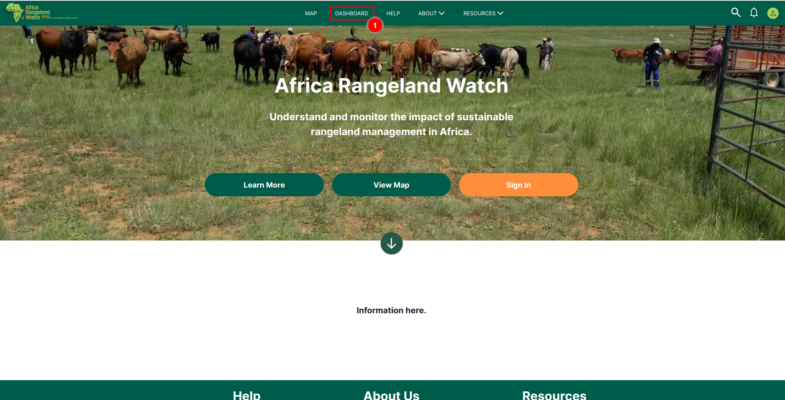
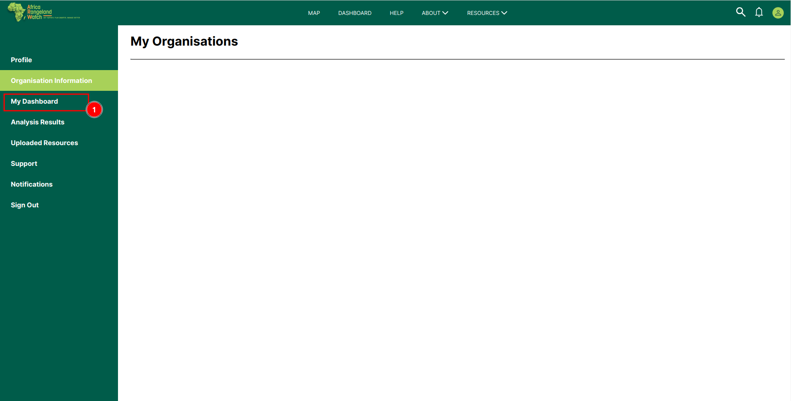
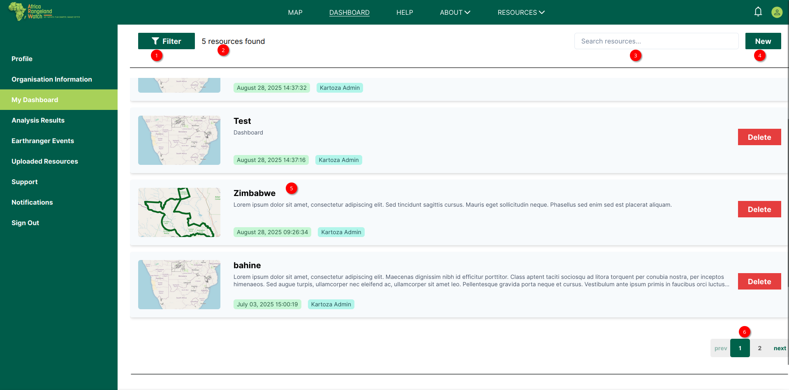

# Dashboard Page: Africa RangeLand Watch (ARW)

To open the dashboard click on the 1️⃣ `DASHBOARD` tab from the navigation bar. This will redirect you to the dashboard page.

## Alternate way to access dashboard

Access the dashboard from the user profile page. Click on the 1️⃣ `My Dashboard` tab from the left menu bar to access the dashboard page.

This is the dashboard page of ARW. This page will allows you to arrange your resources, you can apply 1️⃣ `Filter` on the resources, 2️⃣ `Search` your particular desired resource, create new resources by clicking on the 3️⃣ `New` or you can use 4️⃣ `Organise by` option to arrange your resources.

## How to Use Filter?

## How to Search Resources?

## How to Create New Resources?

## How to Organise Resources?

