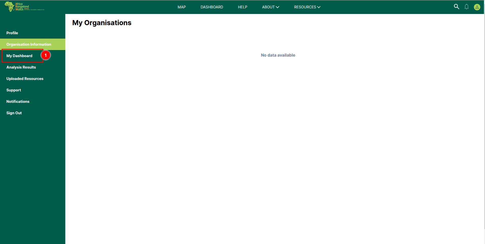

# Dashboard Page: Africa RangeLand Watch (ARW)

To open the dashboard click on the 1️⃣ `DASHBOARD` tab from the navigation bar. This will redirect you to the dashboard page.

## Alternate way to access dashboard

Access the dashboard from the user profile page. Click on the 1️⃣ `My Dashboard` tab from the left menu bar to access the dashboard page.

This is the dashboard page of ARW. You can arrange all dashboards as per your needs by applying the 1️⃣ `Filter` on the dashboard. The number of available resources is displayed at 2️⃣ `Resources Found` near the filter button. You can search for any specific resource using the 3️⃣ `Search` field. To add a new analysis to the dashboard, click on the 4️⃣ `New` button, which will redirect you to the analysis page. You can organise the resources by clicking on the 5️⃣ `Organise` button. You can also change the layout of the dashboard page by selecting a layout through the 6️⃣ `Layout` button. At 7️⃣ `Dashboards`, you can view all available dashboards. You can navigate through the pages using the 8️⃣ `Pagination`.

## How to Use Filter?

To search for a dashboard, use the 1️⃣ `Search` field. You can filter the data by filling in the required 2️⃣ `Fields` as per your needs. To clear the filter form, click on the 3️⃣ `Clear Filter` button.

## How to Add New Analysis to Dashboard?

1. **Click New** on the Dashboard page.  
   

2. **Fill in the details** — Dashboard Name, Description (optional), and Access Level — then **Save**.  
   

3. Use **Add Widget → From Analysis Result** to insert the analysis as a widget (and add more if needed).
   
   

4. The **Choose an Analysis Result** panel appears. **Select** the saved analysis result and confirm.
   

5. The new dashboard is created.  
   

> Tip: If you don’t see your analysis in Step 4, run it on **MAP → Analysis** and click **Save Results** first.

## How to Delete Dashboard?

To delete the dashboard click on the 1️⃣ `Icon`, then a delete confirmation dialog box will appear.

To delete the dashboard click on the `Yes, Delete` otherwise click on the `Cancel` button.

## How to Edit Dashboard?

To Edit the dashboard click on the 1️⃣ `Icon`, then a pop-up dialogue box will appear with the dashboard details.

Fill the necessary details in the 1️⃣ `Form` and then click on the 2️⃣ `Save Changes` button to complete the dashboard editing.

* After submitting the form , the dashboard will be updated with the new details.
