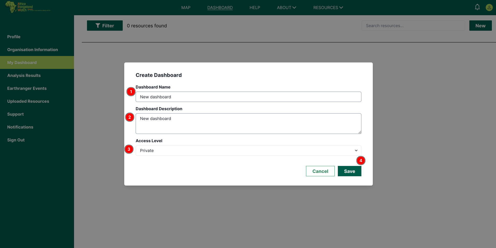
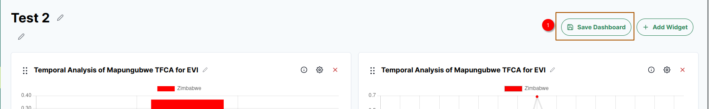

# Dashboard Page: Africa RangeLand Watch (ARW)

To open the dashboard click on the 1️⃣ `DASHBOARD` tab from the navigation bar. This will redirect you to the dashboard page.

## Accessing dashboard

Access the dashboard from the user profile page. Click on the 1️⃣ `My Dashboard` tab from the left menu bar to access the dashboard page.

    

This is the dashboard page of ARW. You can arrange all dashboards as per your needs by applying the 1️⃣ `Filter` on the dashboard. The number of available resources is displayed at 2️⃣ `Resources Found` near the filter button. You can search for any specific resource using the 3️⃣ `Search` field. To add a new analysis to the dashboard, click on the 4️⃣ `New` button, which will redirect you to the analysis page. Each dashboard is listed with thumbnails and informations 5️⃣. You can navigate through the pages using the 6️⃣  `Pagination`.

## How to Create Dashboard?

To create dashboard you first need to check the 1️⃣ `Checkbox` of the respective analysis result you want to create dashboard for, then click on the 2️⃣ `Create Dashboard` button. This will oepn a dashboard creation form.

To create a dashboard, first fill in the 1️⃣ `Form`, then you will be able to click on the 2️⃣ `Save` button. 

* After saving the form, you will be notified by the notification and the respective analysis will be added to the dashboard.

## How to Use Filter?

To search for a dashboard, use the 1️⃣ `Search` field. You can filter the data by filling in the required 2️⃣ `Fields` as per your needs. To clear the filter form, click on the 3️⃣ `Clear Filter` button.

## How to Add New Analysis Widget to Dashboard?

To add a new analysis widget to the dashboard page, go to any dashboard from `My Dashboard`. You can also create a new dashboard following the previous guide. Once you save it, ARW will take you to the newly created dashboard. 

Click on the 1️⃣ `New` button. This will show you widget category to be added.

Currently, ARW has 2 widget categories: 1️⃣ Analysis Result Widget and 2️⃣ Text Widget.

### Text Widget
When you click `Add Text Widget`, it will be added to your dashboard. You can edit 1️⃣ the widget title, 2️⃣ widget size, and widget content 4️⃣. Once you've added content to Text Widget, it will be displayed on 3️⃣.

### Analysis Result Widget
When you click `From Analysis Result`, ARW will show list of Analysis Result. You can see how many analysis are available 1️⃣, search analysis 2️⃣, select the analysis to be added 3️⃣, and OK button 4️⃣ to add analysis to the dashboard.

Depending on the analysis type, few widgets might be added to your dashboard. Here, you can update the widget title 1️⃣, show analysis information 2️⃣, update widget setting 3️⃣, delete widget 4️⃣, select basemap 5️⃣, and see tiff export status 6️⃣.

On map widget, you can show or hide Earth Ranger events by clicking widget settings 1️⃣, then check `Earth Ranger` on th `Layers` 2️⃣.

Once you are done adding widgets and customising your dashboard, click `Save Dashboard` 1️⃣. 

## How to Delete Dashboard?

To delete the dashboard click on the 1️⃣ `Delete` button, then a delete confirmation dialog box will appear.

To delete the dashboard click on the `Yes, Delete` otherwise click on the `Cancel` button.

## How to Edit Dashboard?

To Edit the dashboard click on the 1️⃣ `Icon`, then a pop-up dialogue box will appear with the dashboard details.

Update the `Title` 1️⃣, `Description` 2️⃣ , add or remove widgets following the [`How to Add New Analysis Widget to Dashboard?`](#How-to-Add-New-Analysis-Widget-to-Dashboard?),
then click on the 2️⃣ `Save Dashboard` button to complete the dashboard editing.

* After submitting the form , the dashboard will be updated with the new details.
