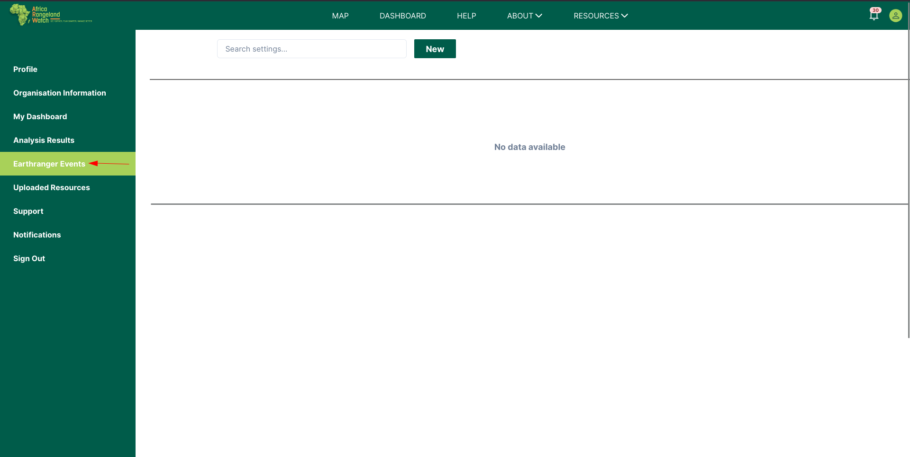
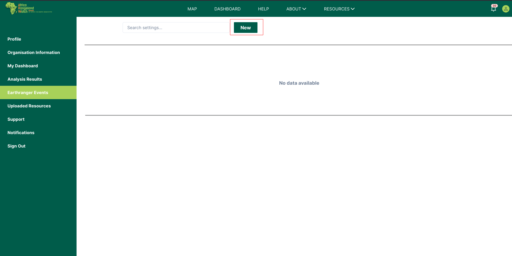
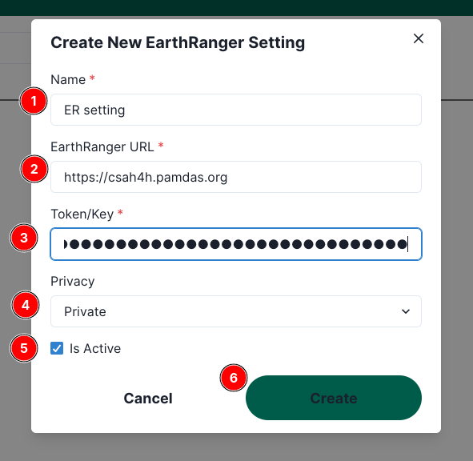
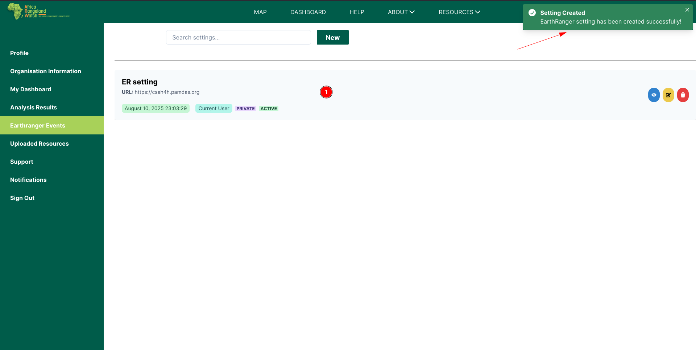
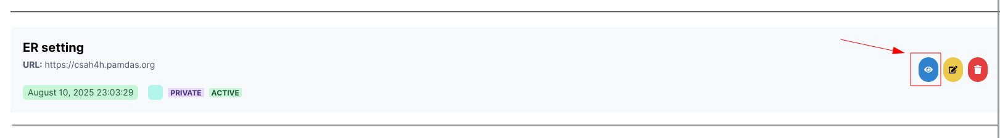
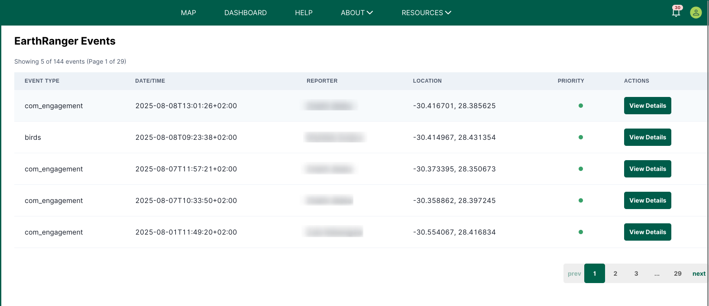
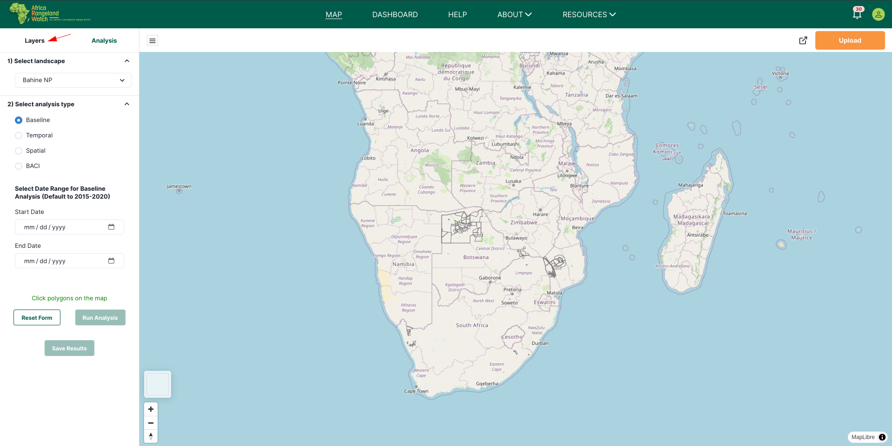
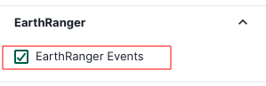
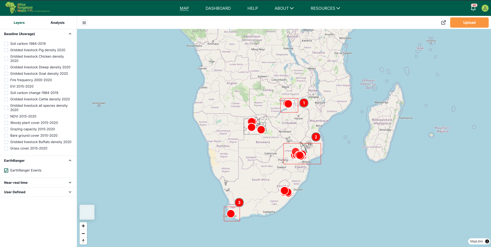
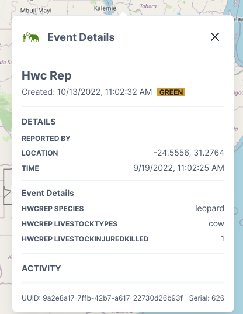

# Earthranger events

## 1. Creating a New EarthRanger Setting

1. In the left-hand menu, click on **1️⃣ `EarthRanger Events`**.  
   

2. Click the **`New`** button to open the creation form.  
   

3. Fill out the form:  
   - **1️⃣ Name** – A label for your setting.  
   - **2️⃣ EarthRanger URL** – The URL to your EarthRanger instance.  
   - **3️⃣ Token/Key** – Your authentication token or key.  
   - **4️⃣ Privacy** – Choose *Private* or *Public*.  
   - **5️⃣ Is Active** – Tick to enable the setting immediately.  
   - **6️⃣ Create** – Click to save.  

   

4. After creating, a **success notification** will confirm your setting has been added.  
   

---

## 2. Managing Existing EarthRanger Settings

- **View** – Click the blue eye icon to see details.  
- **Edit** – Click the yellow pencil icon to update the setting.  
- **Delete** – Click the red trash icon to remove it.  

---

## 3. Viewing the EarthRanger Event List

You can also view EarthRanger events in list format from the **EarthRanger Events** page.  
The list shows:

- Event type  
- Date/time  
- Reporter  
- Location  
- Priority indicator  

In the expanded view:

1. **Priority Indicator** (1️⃣) – A coloured dot showing the urgency level of the event:  
   - 🔴 Red – Low or no priority.  
   - 🟢 Green – High priority.  

2. **Action Button** (2️⃣) – The **`Hide Details`** button collapses the expanded view and returns to the default table view.  

3. **Additional Information** (3️⃣) – Contextual details about the event:  
   - **Comment** – Notes or description provided by the reporter, explaining the context or purpose of the event.  
     Example: “Checking quality of work. For work that SEF team has done looking if they still follow clearing procedures.”  
   - **Village** – The nearest settlement or community to the event location.

---

## 4. Enabling EarthRanger Events on the Map

1. Go to the **Layers** tab.
2. Expand the **EarthRanger** section and tick **`EarthRanger Events`**.  
   

3. The map will display clusters of event locations.  
   

---

## 5. Viewing Event Details

To view more information about an event:

1. Click on the EarthRacnger poinst on the map.

    

2. An event detail panel will open, showing:  
   - **Event title and status**  
   - **Reported by** – Name of reporter  
   - **Location** – Coordinates  
   - **Time** – Event occurrence date/time  
   - **Additional details** – Species, livestock affected, injuries/kills, comments, village name, etc.  

   
