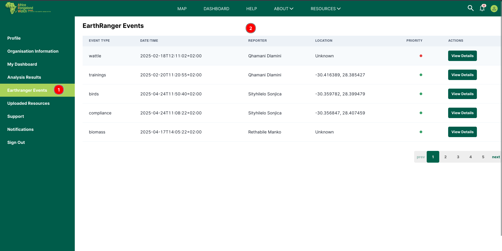
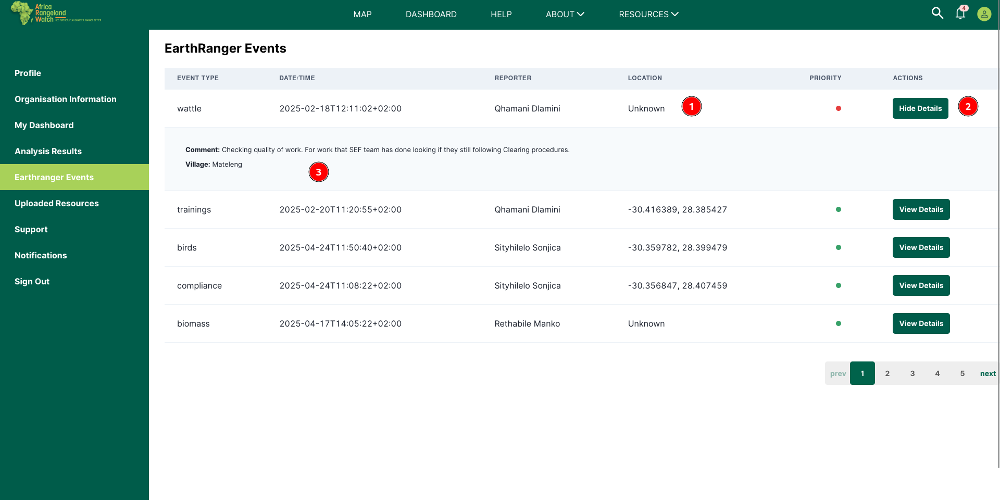
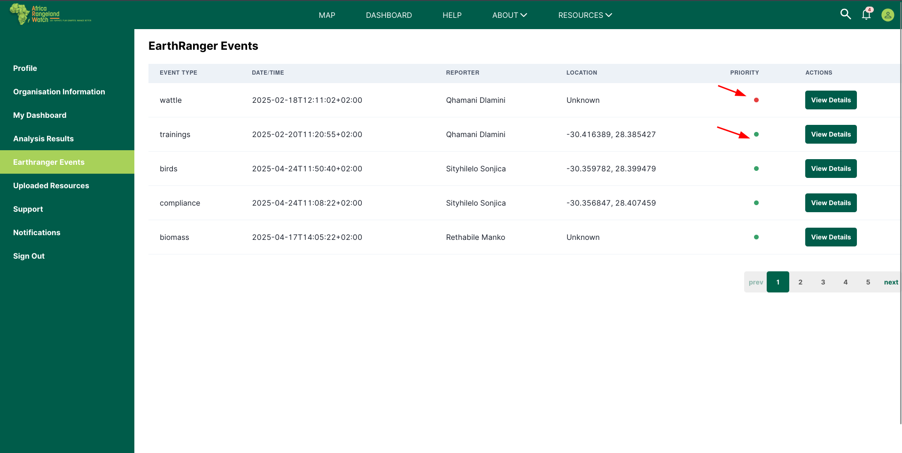

# Earthranger events

Access the Earthranger events page from the user profile page. Click on the 1️⃣ `Earthranger events` tab from the left menu bar to access the Earthranger event page.

The section highlighted by 2️⃣, shows Earthranger events. It lists the event types, dates, reporters, location, priorities and more details.

You can click on `View Details` to view more information. Below you can see the comments and the village where the events were recorded.

Below you can be able to see the priority being highlighted by colours. Red showing it is of no priority, while green shows it is of priority.

