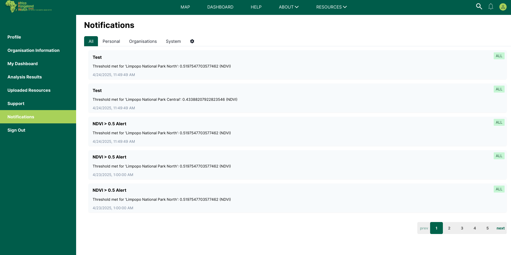
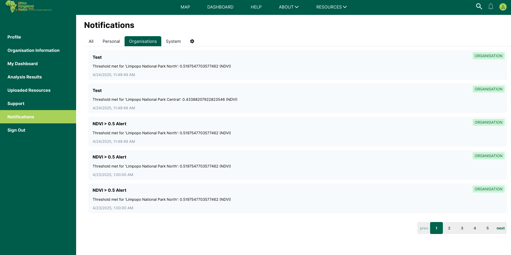
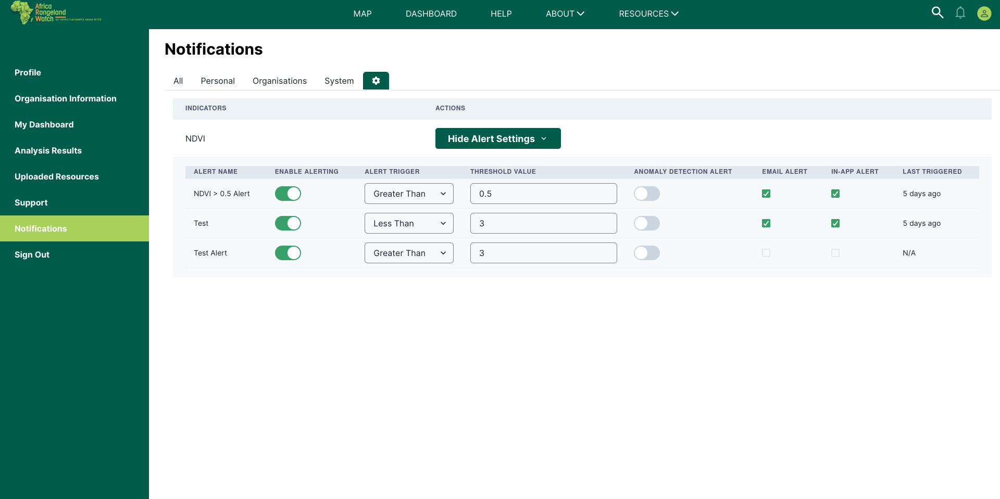

# Notification Page: Africa RangeLand Watch (ARW)

You can access the notification page by clicking on the 1️⃣ `Notification` tab from the left menu.

## All Tab

The `All` tab displays a combined list of all your notifications.  
This includes personal notifications, organisational alerts, and system-wide announcements, all organized in a single view for your convenience.

## Personal Tab

The `Personal` tab shows notifications that are specific to your individual account.  
These alerts are tailored for you and may include updates about your analyses, or personalized alerts related to your activities on the platform.

## Organisations Tab

The `Organisations` tab displays notifications related to the organisations you belong to.  
If you are part of one or more organisations, you will receive shared updates, collaborative analysis results, and important organisational announcements here.

## System Tab

The `System` tab contains platform-wide notifications issued by the Africa Rangeland Watch system administrators.  
These are critical information relevant to all users.

## Settings

In the `Settings` section, you can manage your notification preferences.  
You can choose which types of notifications you want to receive and how you would like to be alerted.

