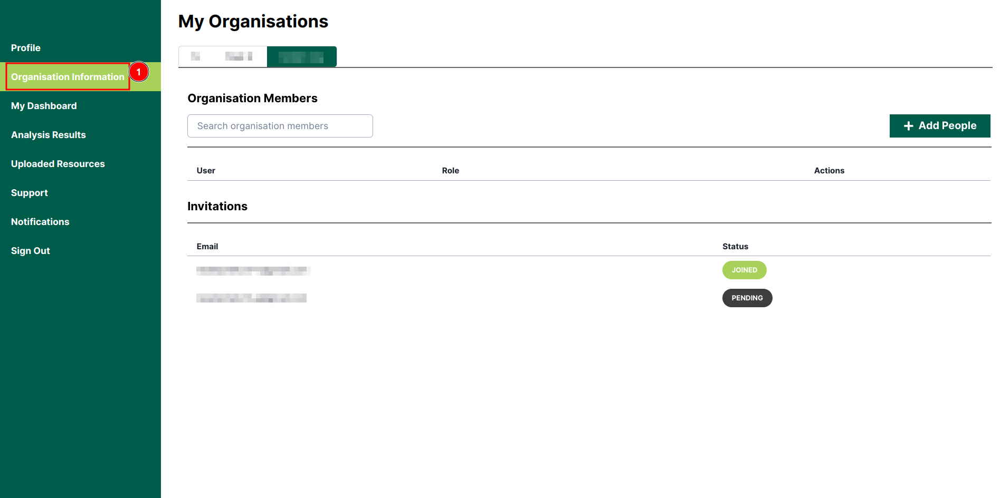
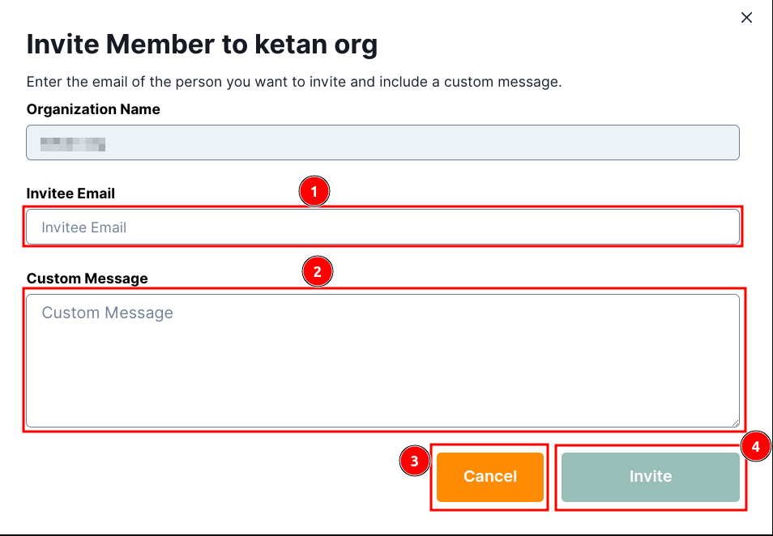
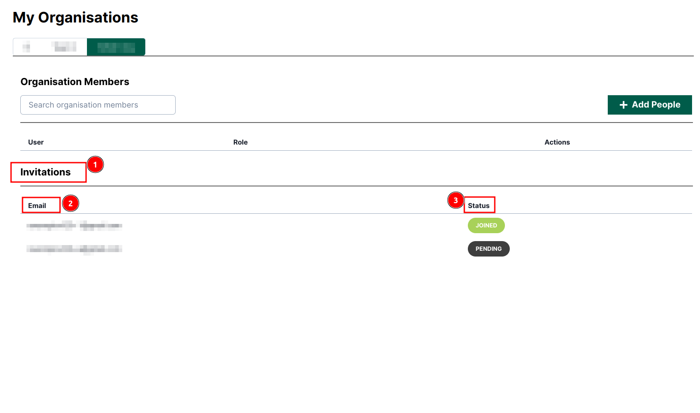
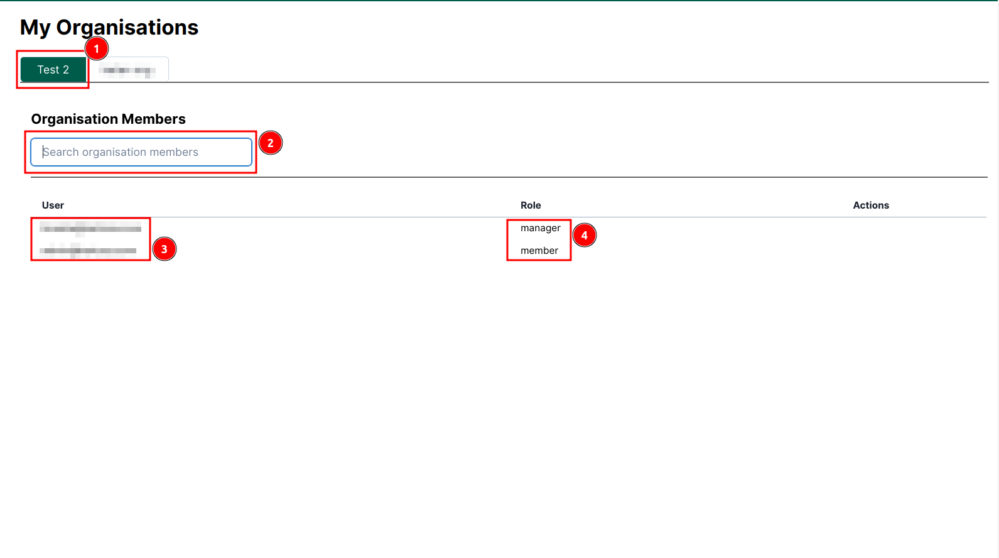

# Organisation Information: Africa RangeLand Watch (ARW)

Click on the 1️⃣ `Organisation Information` from the left navigation bar to access the organisation information page.

## My Organisations

### Default Organisations

### How to Add Organisation Members

Enter the 1️⃣ Email address of the person you wish to add as a member of the organisation. You can also include a 2️⃣ Custom Message. To cancel the process, click on the 3️⃣ Cancel button. Otherwise, click on the 4️⃣ Invite button to send the invitation.

### Invitations

You can view the list of individuals requested to join the organisation in the 1️⃣ `Invitation` section. This includes their 2️⃣ `Emails` and corresponding 3️⃣ `Status`. If the organisation manager accepts the invitation, the status will update to `Joined` otherwise, it will remain as `Pending`.

## Join organisation as a member

If you join the organisation as a member, you will receive different tabs and options.

As you can see in the image below, 1️⃣ `Test 2` is the organisation name, 2️⃣ `Search field` allows you to search for members in the organisation, 3️⃣ `User` email addresses represent the organisation members, and the corresponding 4️⃣ `Role` of each user in the organisation is displayed.

