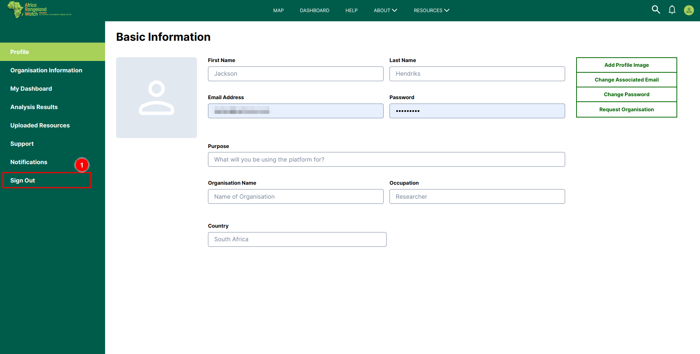

# Sign Out User Profile: Africa RangeLand Watch (ARW)

To sign out from the Africa Rangeland Watch (ARW) platform, simply click on the 1️⃣ `Sign Out` option located in the left-hand menu. This action will securely end your session.

*  Alternate way to sign out from user's profile page

* Click on the 1️⃣ `Profile Icon` and then choose the `Logout` to sign out from the platform.

