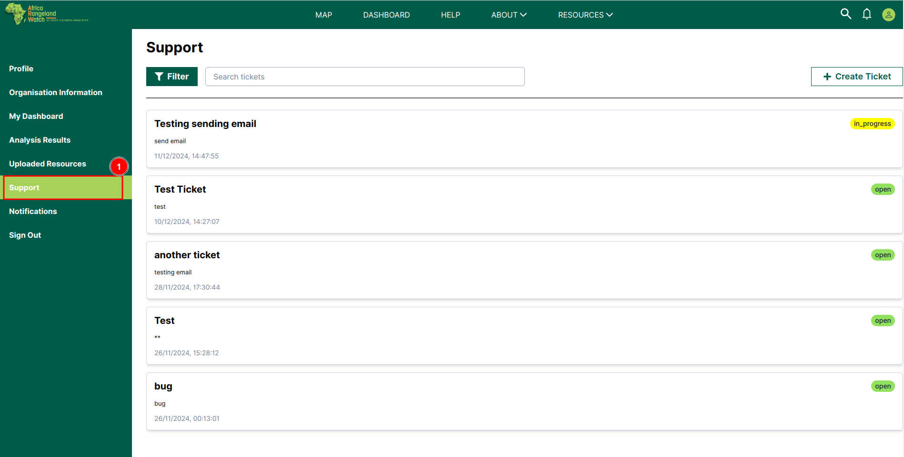
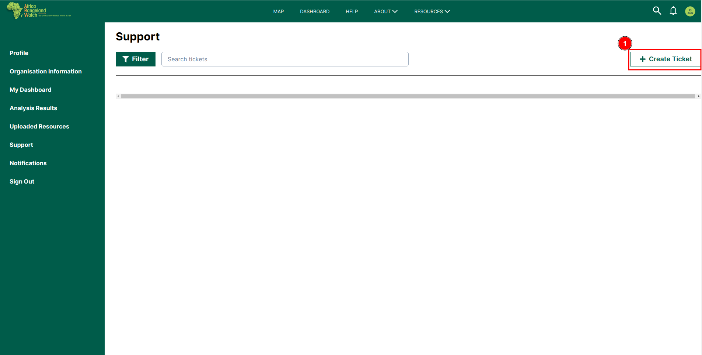

# Support Page: Africa RangeLand Watch (ARW)

To access the support page of the ARW you have to click on the 1️⃣ `Support` tab on the left menu bar.

## How to Create Ticket?

By clicking the 1️⃣ `Create Ticket` button, you will be redirected to a new page where you can provide the necessary details to create a new ticket.

This is the interface of the `Create Ticket` page. To create a new ticket, start by selecting the 1️⃣ `Issue Type` (e.g., Bug, Feature Request) from the drop-down menu. Next, enter the 2️⃣ `Issue Title` to describe the issue. If needed, you can upload relevant files in the 3️⃣ `Upload Attachments` section. Provide more context by filling out the 4️⃣ `Additional Details` field. Once all the information is complete, click on the 6️⃣ `Submit button` to create the ticket, or select 5️⃣ `Cancel` to cancel the request.

* After successfully submitting the ticket, a 1️⃣ `Toast` notification with confirmation message `your support ticket has been added` will appear.

    

* Your submitted ticket will be added to the support page.

    

## How to Upload Attachments?

>Note: You can upload only 1 attachment.

* To upload attachments, click on the 1️⃣ `Upload Attachments` Field, this will open a new window where you can select the file you want to upload.

    

* Select your desired file 1️⃣ `file` and click on the 2️⃣ `Open` button to proceed with the file or you can terminate the process by clicking on the 3️⃣ `Close` button.

    

* As you can see in the below image, after completing the process your desired file 1️⃣ `file` will be uploaded successfully.

    

## How to Remove Attachments?

* Click on the 1️⃣ `Remove` button to remove the attached file.

    

* As you can see in the below image there file attached after clicking on the `Remove` button.

    

## How to Edit Attachment?

* Click on the 1️⃣ `Field` to edit the attachment. This open the file explorer to select the attachment file.

    

* Select your desired file 1️⃣ `file` and click on the 2️⃣ `Open` button to proceed with the file or you can terminate the process by clicking on the 3️⃣ `Close` button.

    

* As you can see in the below image, after completing the process your attached file 1️⃣ `File` will be updated successfully.

    

## How to Filter Tickets?

## How to use Search?

To search the ticket click on the 1️⃣ `Search` field and the keyword you want to search.

For example, if you want to search for `bug`, this is how it will look.

