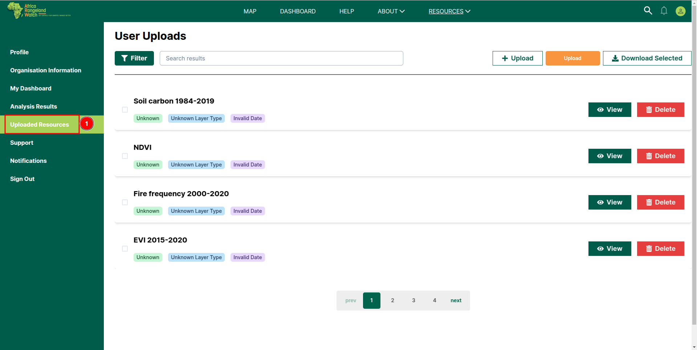
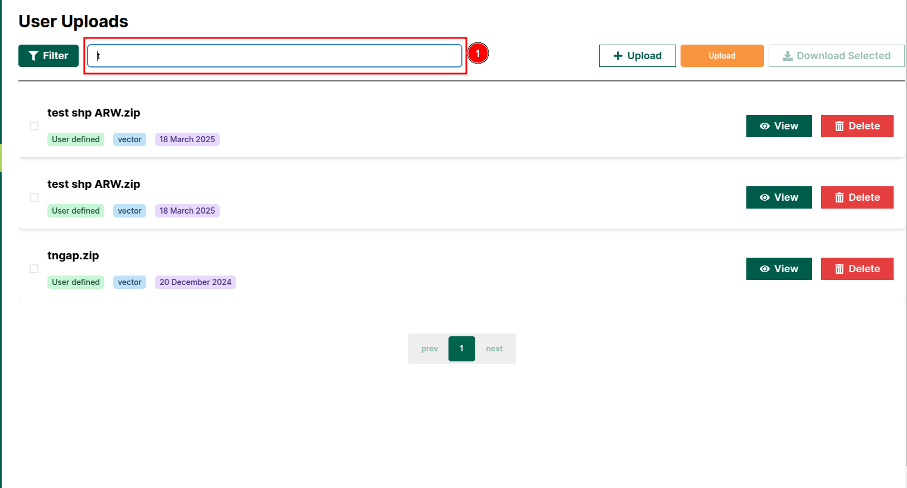

# Uploaded Resources: Africa RangeLand Watch (ARW)

To view the uploaded resources page, click on the 1️⃣ `Uploaded Resources` tab located in the left-hand menu. After clicking on this tab you will be able to access the `Upload Resources` page.

You can filter the data using the 1️⃣ `Filter` option and search for specific data using the 2️⃣ `Search` field. To upload a file, click on the 3️⃣ `Upload` button. To download a resource, select the desired resources and click on the 4️⃣ `Download Selected` button. To view a resource, click on the 5️⃣ `View` button of the respective resource. You can delete any resource by clicking on the 6️⃣ `Delete` button of the respective resource. To navigate through pages, use the 7️⃣ `Pagination` controls. 

## How to Upload Data?

### Method 1: Using map page

The ARW provides you the option for upload the data from the map page.

Click on the 1️⃣ button on the page to upload the data.

To learn how to upload data from the map page, click [here](./map.md#how-to-upload-shape-file).

### Method 2: Using Uploaded Resources Page

To upload a file, click on the 1️⃣ `+Upload` button. This will enable the 2️⃣ `Upload` button—click on it. Then, you will be able to click on the 3️⃣ `Select File` button to choose and upload your desired file. 

## How To Filter Data?

To filter the data, click on the 1️⃣ Filter button. This button functions as a dropdown and opens a filter panel.

You can close this panel by clicking on the 1️⃣ `Up arrow` or the `X` icon at the top right corner. Filter the data by selecting a layer from the 2️⃣ `Select Layer Type` dropdown or by choosing a date from the 3️⃣ `Select Date` input field.

## How to Search Data?

Click on the 1️⃣ `Search` field then enter the keyword to search for the data.

For example, if you want to search for data using the keyword `t`, the result will be:

## Uploaded Data

As you can see in the image below, 1️⃣ `Current data` uploaded by you, and 2️⃣ `View` button allows you to view the uploaded data on the map.

## How to Delete Data?

To delete a resource, click on the 1️⃣ `Delete` button of the respective resource.

