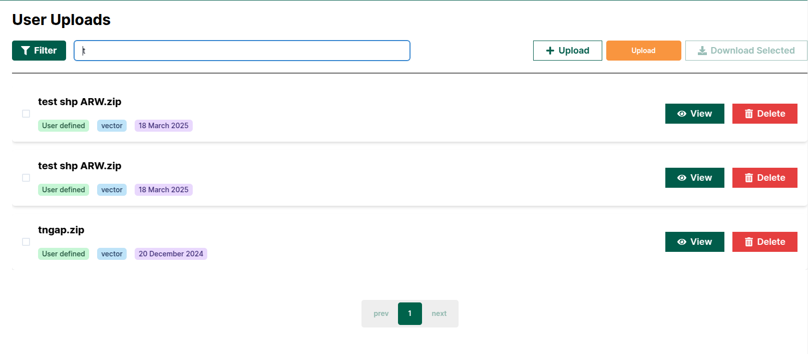

# Uploaded Resources: Africa RangeLand Watch (ARW)

To view the uploaded resources page, click on the 1️⃣ `Uploaded Resources` tab located in the left-hand menu.

## How to Add Data?

### Method 1: Using map page

The ARW provides you the option for upload the data from the map page.

Click on the 1️⃣ button on the page to upload the data.

To learn how to upload data from the map page, click [here](./map.md#how-to-upload-shape-file).

### Method 2: Using Uploaded Resources Page

## How To Filter Data?

## How to Search Data?

Click on the 1️⃣ `Search` field then enter the keyword to search for the data.

For example, if you want to search for data using the keyword t, the result will be:

## Uploaded Data

As you can see in the image below, 1️⃣ `Current data` uploaded by you, and 2️⃣ `View` button allows you to view the uploaded data on the map.

