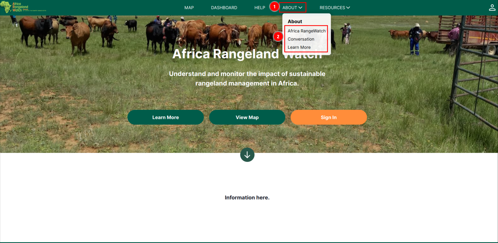
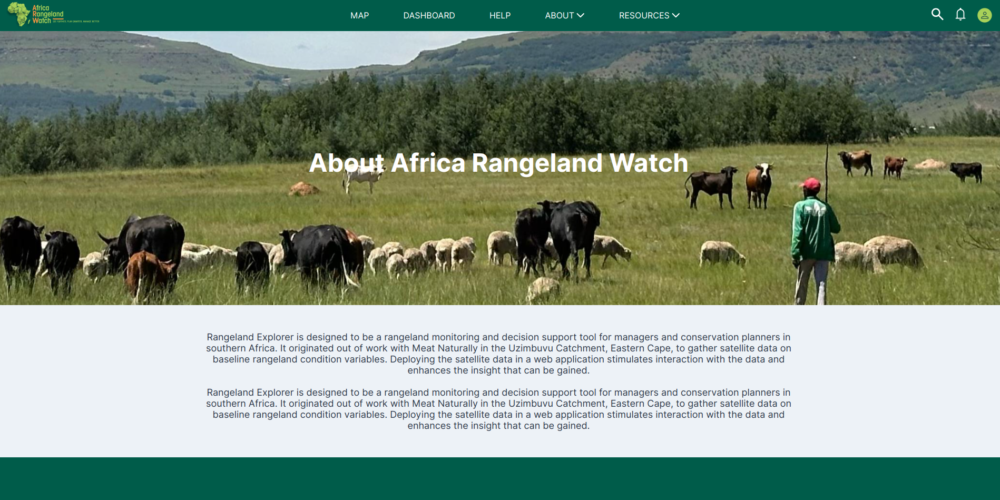
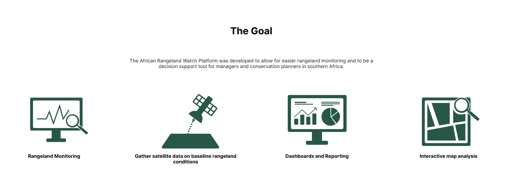
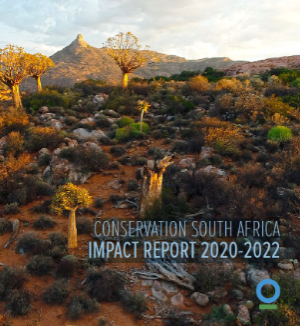
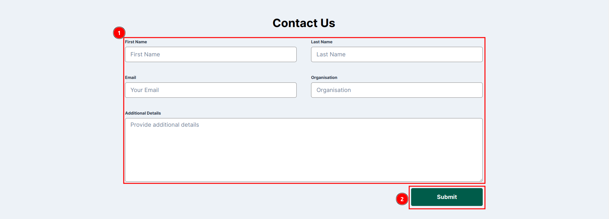

# Dashboard Page: Africa RangeLand Watch (ARW)

To access the About page, hover over the 1️⃣ `ABOUT` tab in the top navigation bar. A 2️⃣ `Dropdown` menu will appear with options such as `Africa RangeWatch`, `Conservation`, and `Learn More`. Each option redirects to a new page.

## Africa RangeWatch

This option takes you to the `Africa RangeWatch` page, which provides an overview of the platform.

This about page is divided into several sections, each providing information on a different aspect of the platform.

### Basic Details

### Management Section

#### The Goal

The Goal section outlines the primary objective of the platform, providing you with a clear understanding of its purpose and intended impact. It highlights the platform’s mission and the key outcomes it aims to achieve, offering insight into how the platform supports sustainable rangeland management and conservation efforts.

* **Rangeland Monitoring:** How the platform supports rangeland monitoring and conservation efforts.

* **Gather satellite data:** How the platform gathers satellite data to support rangeland monitoring and conservation efforts.

* **Dashboard and Reporting:** How the platform provides a dashboard and reporting features to support rangeland monitoring and conservation efforts.

* **Interactive map analysis:** How the platform provides interactive map analysis to support rangeland monitoring and conservation efforts.

#### Impact Report

* To view the `Conservation South Africa Impact Report 2020-2022` click on the image below.

    

#### Contact Us

To contact the ARW team, use the contact us form. Fill in the required details in the 1️⃣ `Form` and click the 2️⃣ `Submit` button to send your message.

## Conversation

## Learn More

### What is Herding for Health?

The aim of this joint initiative of Conservation International and Peace Parks Foundation is to restore high biodiversity indigenous grasslands, savanna, and shrublands, improve animal health, and provide market access while promoting biodiversity conservation in and around protected areas in Africa.

### Pamphlet

Herding for Health [Pamphlet](https://arw.dev.do.kartoza.com/static/Herding.for.Health.pdf).
