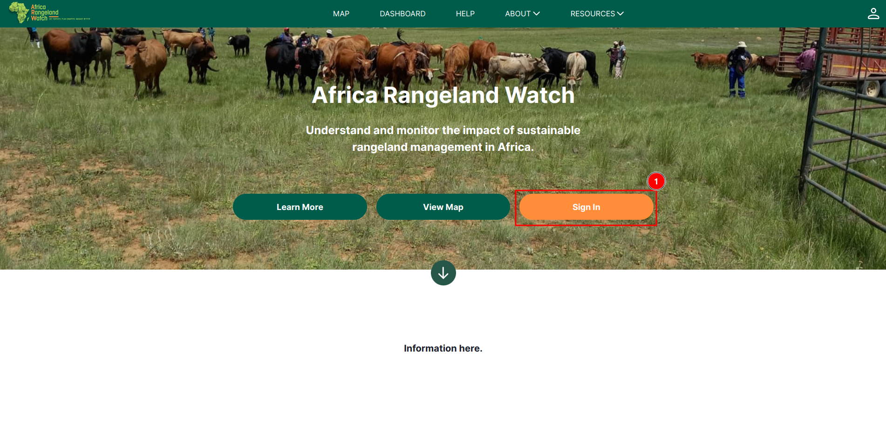
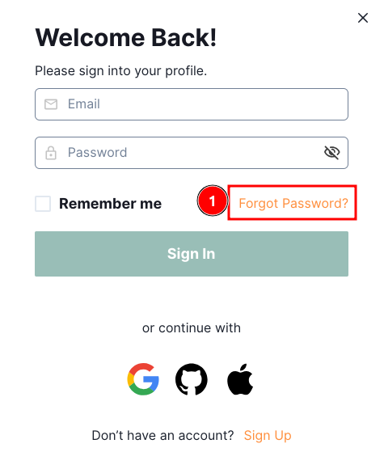
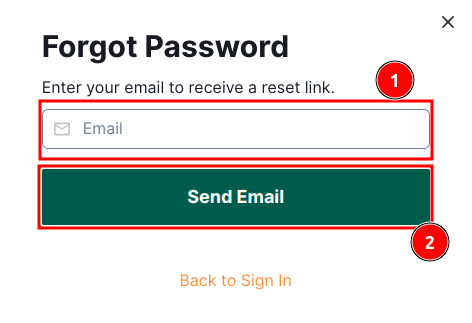
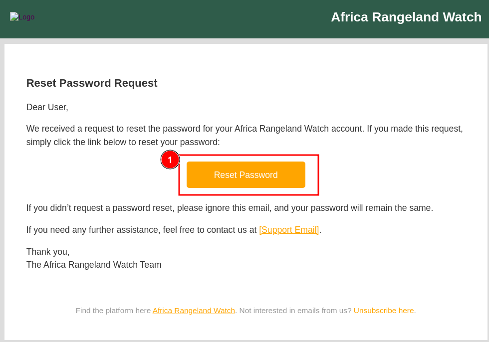
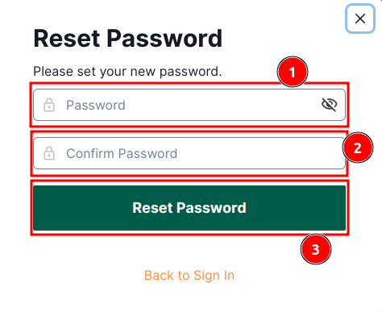
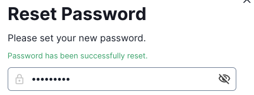
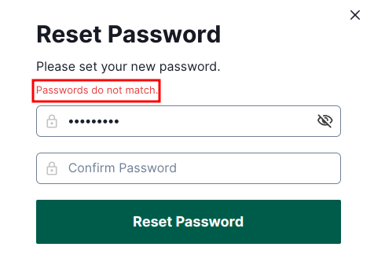
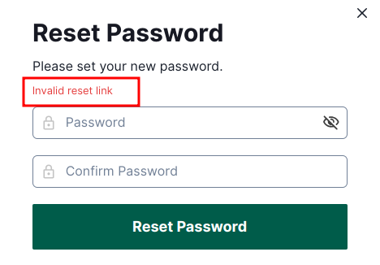

# User Guide: Forgot Password on Africa RangeLand Watch (ARW)

Click on the 1️⃣ `Sign In` button to access the sign-in page, where you will find the `Forgot Password` link.

Click on the 1️⃣ `Forgot Password` link to access the forgot password page.

Enter your registered email address in the 1️⃣ `Email` field and click on the 2️⃣ `Send Email` button.

* After clicking on the `Send Email` button, you will be notified with a message stating that the `reset link sent to your email`.

    

Open the email sent by ARW and click on the 1️⃣ `Reset Password` button. This will redirects you to the reset password page.

Enter your new password in the 1️⃣ `Password` input field and confirm it in the 2️⃣ `Confirm Password` input field. After filling the required fields, click on the 3️⃣ `Reset Password` button.

After completing the process you will be notified with a message stating that the `Password has been successfully reset`.

**Error:**

* **Passwords do not match:** If you forget to fill any of the input fields and click the `Reset Password` button, you will be notified with an error message.

    

* **Invalid reset link:** If you forgot to fill both the password and confirm password fields and click the Reset Password button, you will be notified with an error.

    

