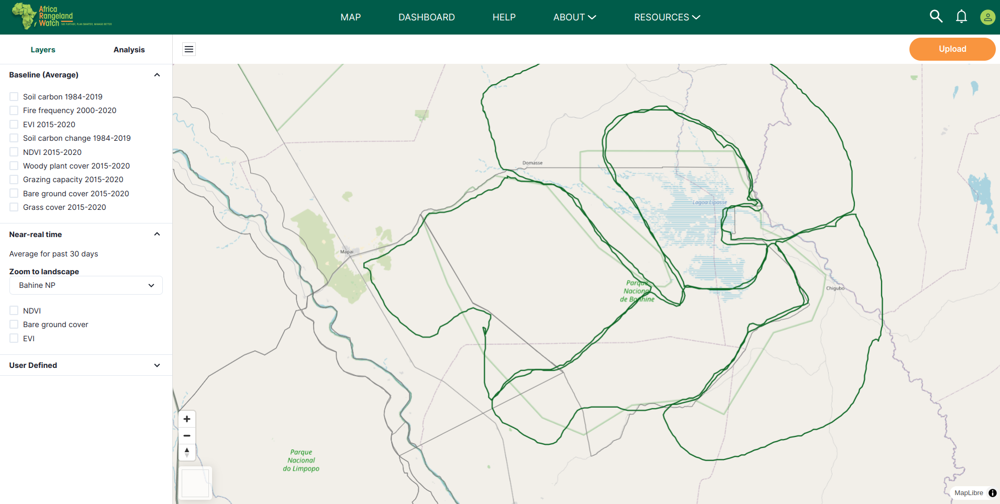
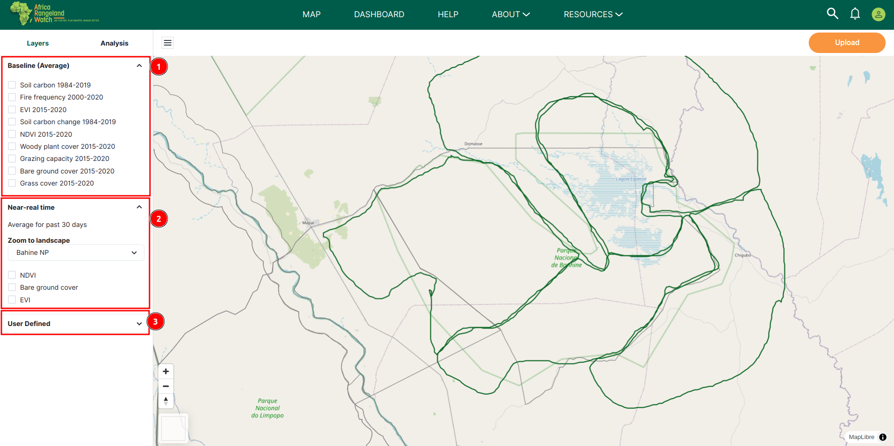
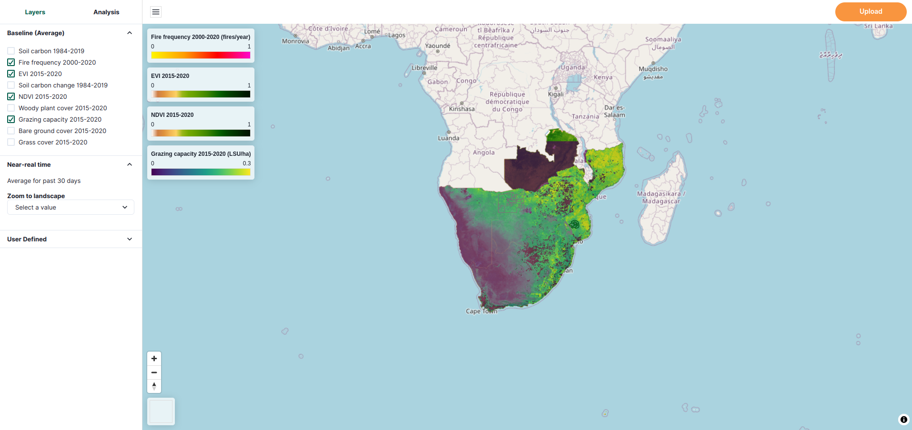
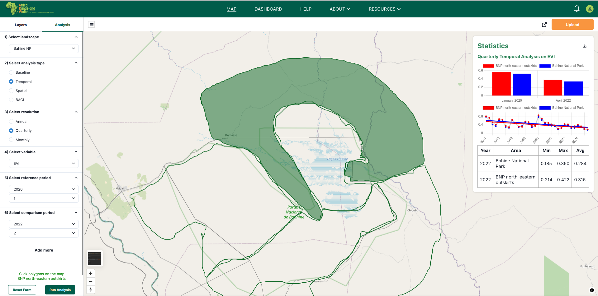
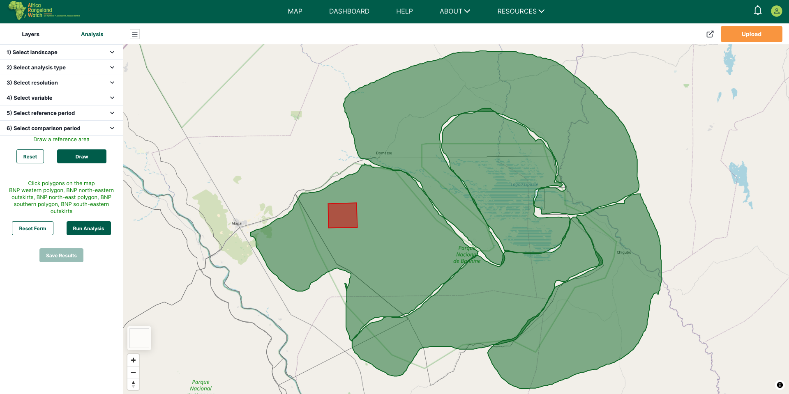
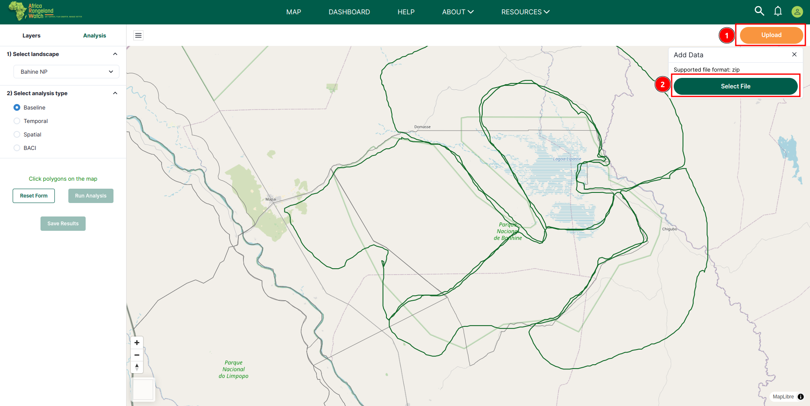

# MAP: Africa RangeLand Watch (ARW)

Click on the 1️⃣ `MAP` option in the navigation bar to access the interactive map feature.

After clicking on the `MAP` option, you will be redirected to the interactive map page.
The image below illustrates the interactive map page of the ARW platform.

## How to access the interactive map feature?

### Layers

The interactive map feature allows you to view and interact with various layers of information.

To access the layers, click on the 1️⃣ `Layers`, this section is selected by default. This section allows you to apply various types of layers on the map, enabling customised visualisation. This is how it looks.

To apply layers to the map, you can choose layers from the 1️⃣ `Baseline` option. In the 2️⃣ `Near-real time` option, you can further refine their view by selecting a specific landscape through the `Zoom to landscape` drop-down menu. Moreover, additional variables can be applied by checking the corresponding boxes from the available options listed at the bottom of the layer's section.

#### Baseline (Average)

Users can select multiple variables simultaneously, and the map will display data for all selected variables. However, the most recently applied variable will be highlighted for improved visibility.

* Map before applying the `Baseline (average)` layers

    

* Map after applying the `Baseline (average)` layers

    

    

* Map after applying multiple `Baseline (average)` layers

    

    > Note: You can apply multiple baseline layers, and the map will display data for all selected layers. However, the most recently applied layer will be displayed more clearly for better visibility.

### Variables

Variables are those that are used to compute temporal and spatial statistics for different areas within the app. You can apply the variable of your choice by checking the corresponding checkbox.

> Note: You can select multiple variables simultaneously, and the map will display data for all selected variables. However, the most recently applied variable will be highlighted for improved visibility.

#### EVI 

The enhanced vegetation index (EVI) is a spectral index calculated from satellite data in the near-infrared, red and blue wavelengths (Liu and Huete, 1995). EVI is a good proxy for vegetation vigour, greenness, biomass and cover. Relative to NDVI (see below), EVI simultaneously corrects for atmospheric and soil effects and does not saturate over high vegetation biomass. It has been used to map rangeland restoration and degradation trends over South Africa in Venter et al., 2020. We calculate baseline EVI at 250m resolution from the MOD13Q1 dataset derived from the MODIS satellites. For NRT and analysis EVI at the landscape scale, we calculate EVI from cloud-masked mosaics of Sentinel-2 imagery at 10m resolution.

#### NDVI

The normalised difference vegetation index (NDVI) is very similar to the EVI however it is more sensitive to sparse vegetation (Tucker 1979). It is therefore good for use in arid areas where one does not expect high levels of vegetation greenness. We calculate baseline EVI at 250m resolution from the MOD13Q1 dataset derived from the MODIS satellites. For NRT and analysis of EVI at the landscape scale, we calculate EVI from cloud-masked mosaics of Sentinel-2 imagery at 10m resolution.

#### Bare grounds cover 

Bare ground cover refers to the proportion of the landscape where the surface is exposed without significant vegetation, such as grass or woody plants. These areas may consist of soil, sand, or rock and are important in ecological assessments as they affect processes like erosion, water infiltration, and habitat stability.

### Analysis?

Analysis allows you to select a specific landscape from the 1️⃣ `Select Landscape` drop down menu.

After selecting the landscape you will be able to select the analysis type from the 1️⃣ `Select analysis type` drop down menu. 

Available options in `Select analysis type` are:

#### How to do Baseline Analysis?

* **Baseline:** After selecting this option you have to select the polygons from the map and then you can go for the analysis.

#### How to do Temporal Analysis?

* **Temporal:** After selecting the temporal you will be able to select to the following options:
    - **Select temporal resolution:** You can choose whether to use the `Annual` or `Quarterly` option based on their preference.

    - **Select variable:** You can choose the variable they want to analyse from the available options.

    - **Select reference period:** This feature allows you to select a time period based on their preference. If they choose the Quarterly option, they can further specify the desired quarter for a more focused analysis.

    - **Select comparison period:** You can also choose the time period for the comparison.

    

#### How to do Spatial Analysis?

* **Spatial:** After selecting this option, you can choose a specific variable. Next, you need to select a polygon from the map. Once the selections are made, you can proceed with the analysis.

    

#### How to do BACI Analysis?

* **BACI:** This option allows you to directly go for analysis by clicking on the  `Run Analysis` button.

    

**Note**: One can now run analysis for multiple polygons by selecting them on the map.

After filling in the necessary details, you can proceed with the analysis by clicking on the 3️⃣ `Run Analysis` button after running the analysis successfully you can click on the 4️⃣ `Save Results` button to save analysis result. If you wish to reset the form, simply click on the 2️⃣ `Reset Form` button.

After saving the analysis results, you will be notified by a 1️⃣ `toast notification` stating that the analysis results have been saved. You can view the saved analysis on the [Analysis Results](./Analysis-result.md) page.

### How to Upload Shapefile

Click on the 1️⃣ `Upload` button and then click on the 2️⃣ `Select File` button to upload your shapefile.

Select the desired 1️⃣ `File` then click on the 2️⃣ `Select` button to upload the file or can click on the 3️⃣ `Cancel` button to close the file explorer.

