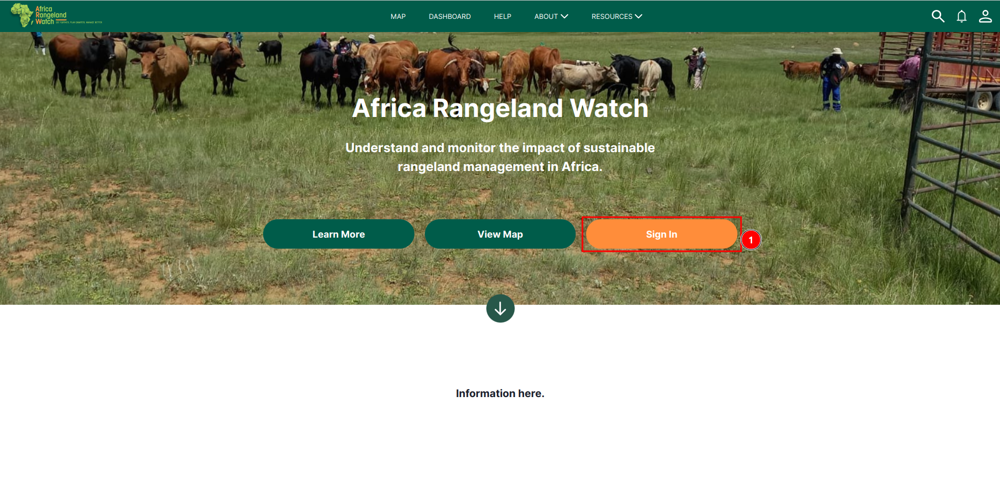
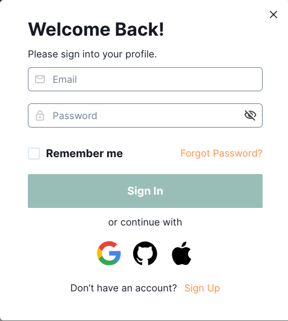
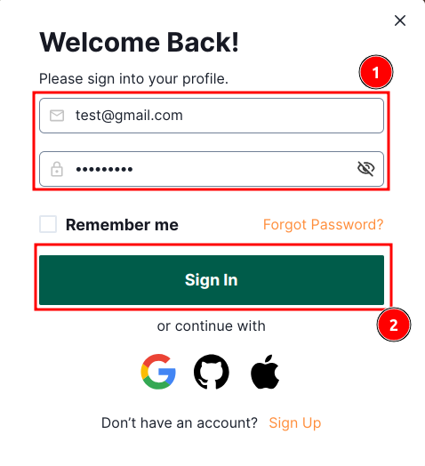
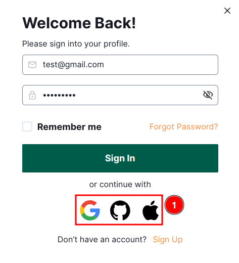
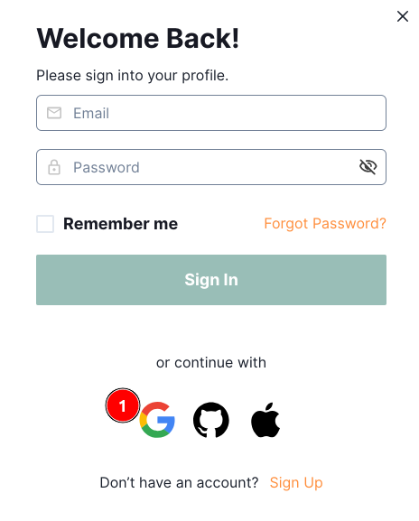
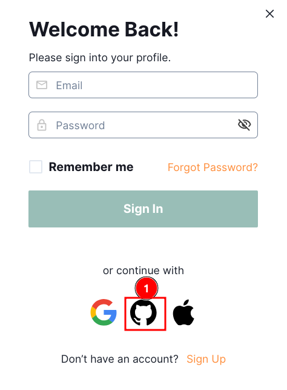
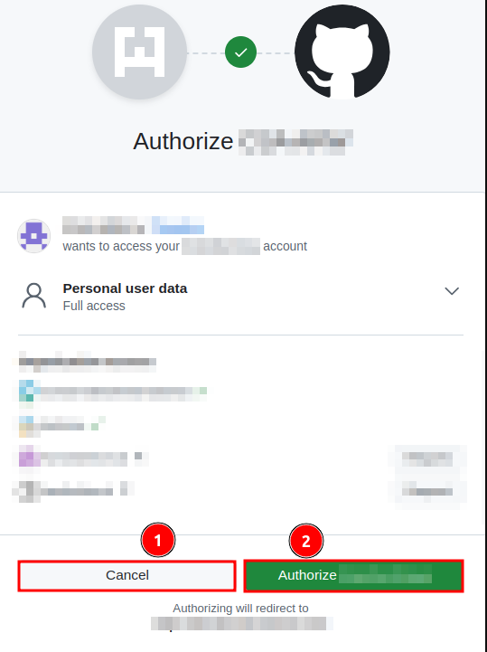
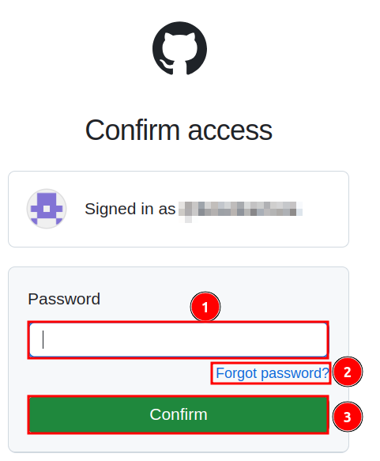
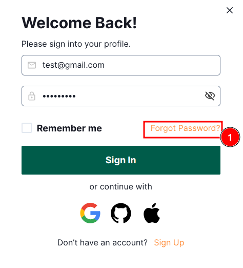
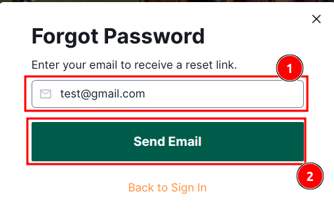

---
title: Africa Rangeland Watch
summary: Understand and monitor the impact of sustainable rangeland management in Africa.
    - Ketan Bamniya
    
date: 22/01/2025
some_url: https://github.com/kartoza/africa_rangeland_watch
copyright: Copyright 2023, Africa Rangeland Watch
contact: Perushan Rajah, prajah@conservation.org
license: This program is free software; you can redistribute it and/or modify it under the terms of the GNU Affero General Public License as published by the Free Software Foundation; either version 3 of the License, or (at your option) any later version.
--- 

# User Guide: Sign-In on Africa RangeLand Watch (ARW)

## How to sign-in on the site.

Follow these steps to sign-in on the site:

Click on the 1️⃣ `Sign in` to open the sign-in form.

Here is the `Sign In` form.

### There are two options are available for sign in:

#### Option 1: Manually fill the details.

Enter your `Email` and `Password` in the respective fields in the 1️⃣ `form` and then click on the 2️⃣ `Sign In` button to complete the process. 

* **Remember me:** If you want to stay signed in on this device, check the `Remember me` box.

#### Option 2: Use other accounts like google, github and apple to sign-in.

User can also use 1️⃣ other accounts like google, github and apple to sign-in to the website.

### How to sign in using google

Click on this 1️⃣ `Google` button to sign in using your google account.

### How to sign in using github

>Note: For the first time you have to authorise the app to access your github account.

Click on the 1️⃣ `Github` icon to sign-in using your github account.

Click on the 1️⃣ `Cancel` button to cancel the process, or click on the 2️⃣ `Authorise` button to complete the process.

Enter your 1️⃣`Password` and click on the 3️⃣`Confirm` button to complete the process. In case you forgot your password, click on the 2️⃣`Forgot Password` link to reset it.

### How to reset password:

If you forgot your password, you can reset it by clicking on the 1️⃣ `forgot Password`. This will open a new form.

Enter your registered email id in the 1️⃣ `input field` and then click on the 2️⃣ `Send Email` to reset the password.

* If you want to see how to create account please click [here](./sign-up.md).
