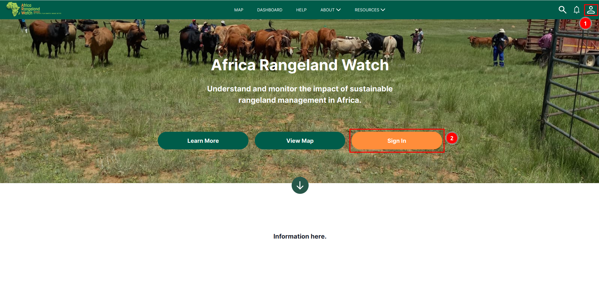
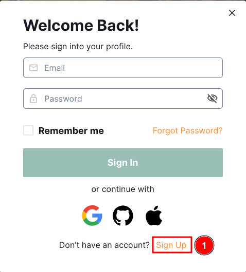
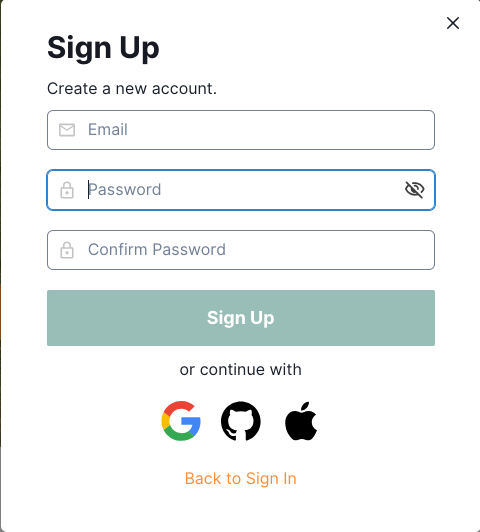
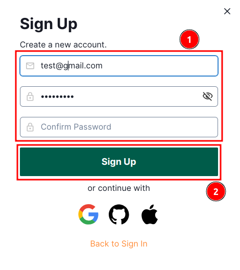
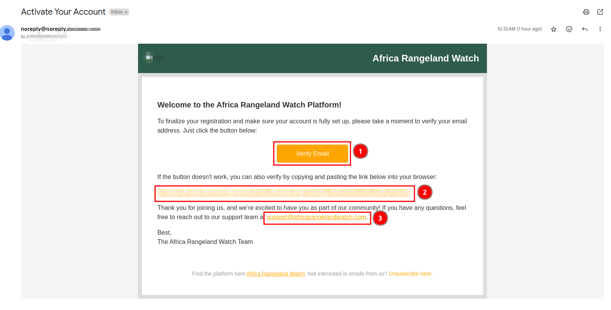
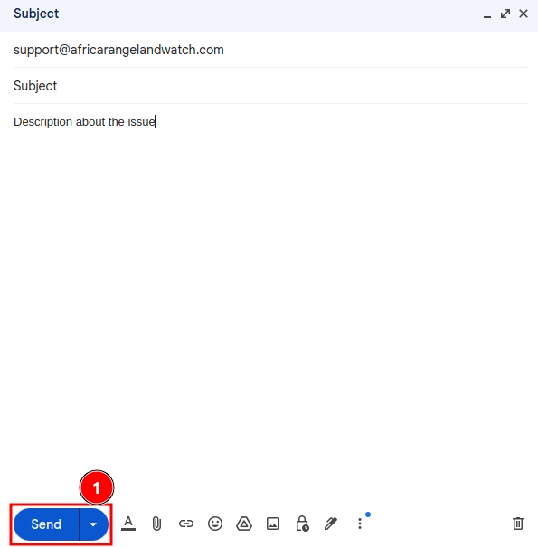
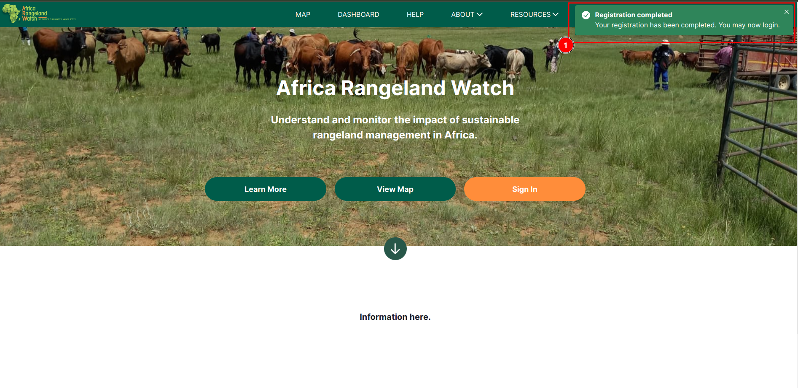
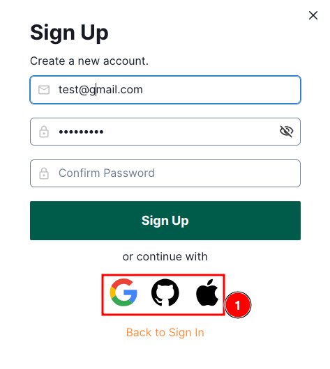
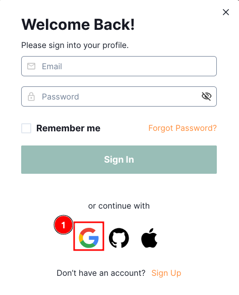
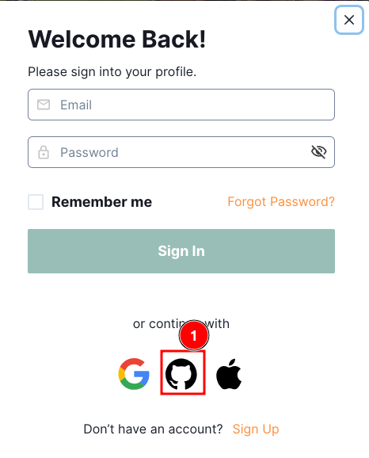

---
title: PROJECT_TITLE
summary: PROJECT_SUMMARY
    - PERSON_1
    - PERSON_2
date: DATE
some_url: PROJECT_GITHUB_URL
copyright: Copyright 2023, PROJECT_OWNER
contact: PROJECT_CONTACT
license: This program is free software; you can redistribute it and/or modify it under the terms of the GNU Affero General Public License as published by the Free Software Foundation; either version 3 of the License, or (at your option) any later version.
--- 

# User Guide: Sign-Up on Africa RangeLand Watch (ARW)

## How to sign-up on the site.

Welcome to the `Africa RangeLand Watch!` Follow these steps to sign-up on the site:

Click on the 1️⃣ `profile` or you can simply click on the 2️⃣ `sign-up`.

This will open a pop-up window. In this window click on the 1️⃣ `sign-up` button.

Here is the sign-up form.

### There are two methods to sign-up on the site:

#### Method 1: Manually fill the information in the form.

- **Email:** Enter your valid email address.
- **Password:** Enter your password.
- **Confirm Password:** Re-enter your password to confirm.

* After filling the 1️⃣ `form`, click on the 2️⃣ `sign-up` button this will send a verification link to the associated email address.

* You can verify your account by clicking on the 1️⃣ `Verify Email` button. If the button is not functioning, you can use the 2️⃣ `link  `provided to complete the verification process. After clicking on the verify button or link you will be redirected to the `ARW` home page. You can also click on the 3️⃣ `support link` if you have any issue.

    

* After clicking on the support link, a message window will open. You will need to fill in the subject and description of the issue, then click the 1️⃣ `Send` button to submit the message or you can click on the `X` mark to close the window.

    

* A toast notification will confirm your registration with the message: 1️⃣ `Registration completed`.

    

#### Method 2: Sign-up using other accounts like google, github and apple.

* If you already have an account and you want to sign-in please click [here](./sign-in.md).

#### How to sign-up using google

Click on the 1️⃣ `Google` button. This will open a new window. You will be asked to choose your account.

To know the further process click [here](../manual/sign-up.md#sign-up-using-google).

#### How to sign-up using github

Click on the 1️⃣ `GitHub` button. This will open a new window.

For the further process click [here](../manual/sign-up.md#sign-up-using-github).
