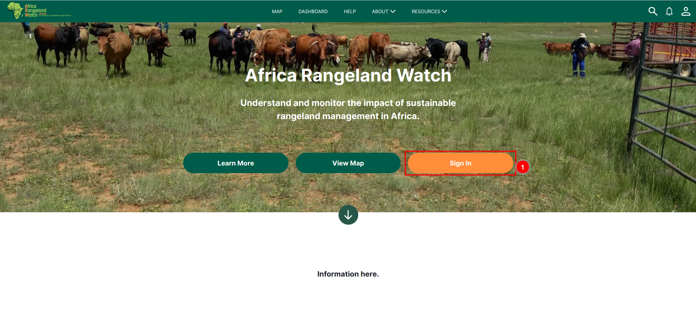
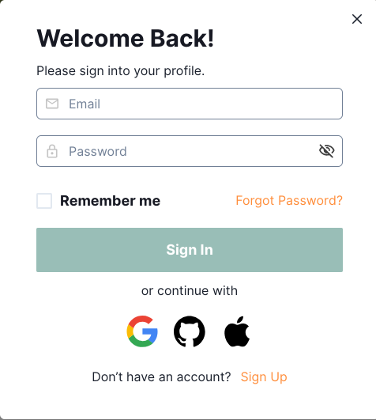
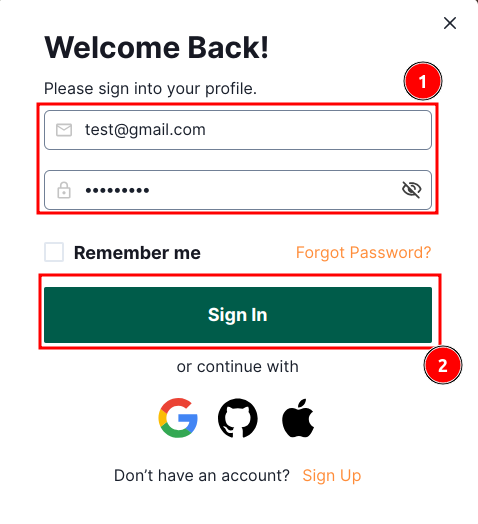
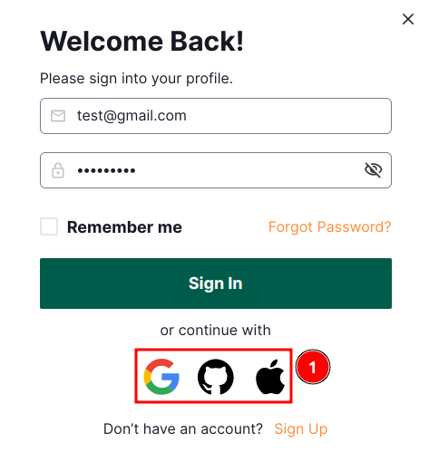
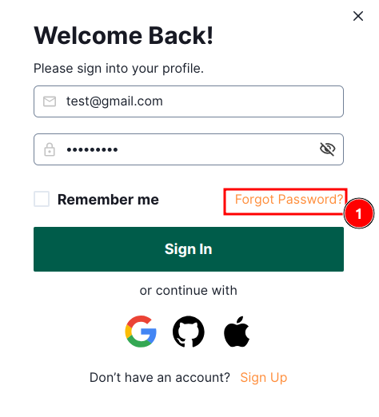
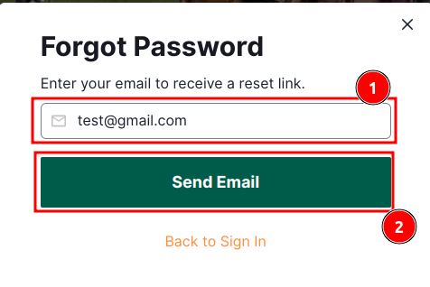

---
title: PROJECT_TITLE
summary: PROJECT_SUMMARY
    - PERSON_1
    - PERSON_2
date: DATE
some_url: PROJECT_GITHUB_URL
copyright: Copyright 2023, PROJECT_OWNER
contact: PROJECT_CONTACT
license: This program is free software; you can redistribute it and/or modify it under the terms of the GNU Affero General Public License as published by the Free Software Foundation; either version 3 of the License, or (at your option) any later version.
--- 

# User Guide: Sign-In on Africa RangeLand Watch (ARW)

## How to sign-in on the site.

Follow these steps to sign-in on the site:

Click on the 1️⃣ `Sign in` to open the sign-in form.

Here is the `Sign In` form.

### There are two options are available for sign in:

#### Option 1: Manually fill the details.

Enter your `Email` and `Password` in the respective fields in the 1️⃣ `form` and then click on the 2️⃣ `Sign In` button to complete the process. 

* **Remember me:** If you want to stay signed in on this device, check the `Remember me` box.

#### Option 2: Use other accounts like google, github and apple to sign-in.

User can also use 1️⃣ other accounts like google, github and apple to sign-in to the website.

## Forgot Password

### How to reset password:

If you forgot your password, you can reset it by clicking on the 1️⃣ `forgot Password`.This will open a new form.

Enter your registered email id in the 1️⃣ `input field` and then click on the 2️⃣ `Send Email` to reset the password.

* If you want to see how to create account please click [here](./sign-up.md).