# Profile: Africa RangeLand Watch (ARW)

Click on the 1️⃣ `Profile` tab to access the Africa Rangeland Watch (ARW) profile. This tab is selected by default. The 2️⃣ `Basic Information` section displays essential details about the admin, while the 3️⃣ `Operations` section provides various actions, such as `Add Profile Image`, `Change Associated Email`, `Change Password`, and `Request Organisation`.

[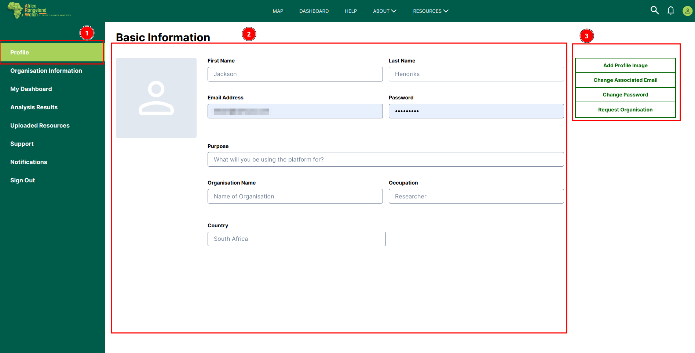](./img/guide-profile-img-1.png)

## Basic Information

The Basic Information section includes details such as the admin's name, email address, profile image, and other relevant information.

[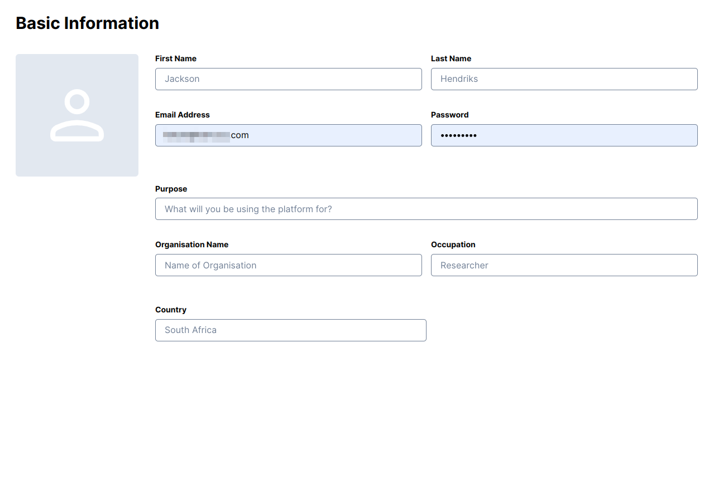](./img/guide-profile-img-2.png)

## How to Add Profile Image?

To add a profile image, click on the 1️⃣ `Profile Icon` to open the file explorer. Select the desired image and click on the 2️⃣ `Upload Profile` Image button to upload it.

[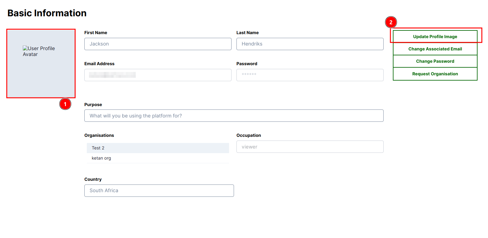](./img/guide-profile-img-5.png)

* **Success Notification:** After successfully uploading the image, a success 1️⃣`Notification` will be displayed.

    [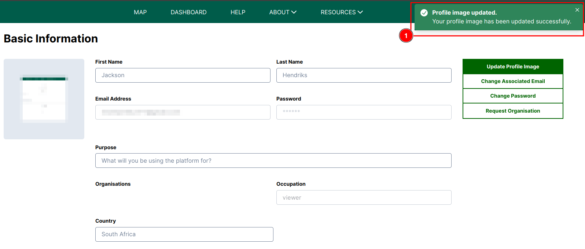](./img/guide-profile-img-6.png)

* **Error Notification:** If you click on the `Upload Profile Image` button without selecting an image, an error 1️⃣ `Notification` will be displayed.

    [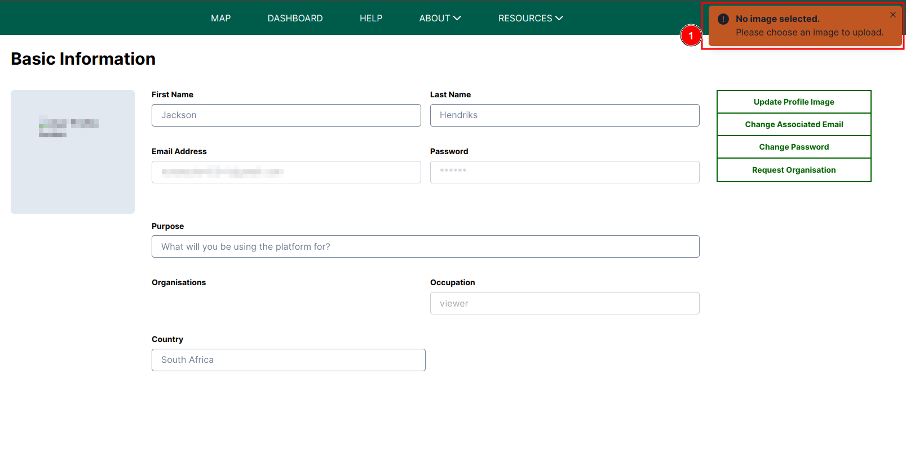](./img/guide-profile-img-7.png)

## How to Change Associated Email

## How to Change Password?

Click on the 1️⃣ `Change Password` tab to access the change password form.

[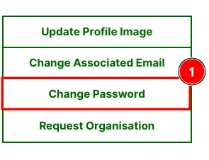](./img/guide-profile-img-13.png)

Enter your 1️⃣ `Current Password`, 2️⃣ `New Password`, and 3️⃣ `Repeat New Password`. Then, click on the `Update` button to change the password or the `Cancel` button to close the form.

[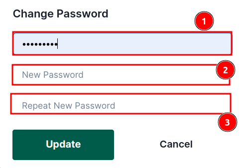](./img/guide-profile-img-14.png)

* You will receive this error if you enter the wrong current password.

    [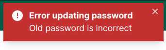](./img/guide-profile-img-15.png)

* You will receive this notification if your password is successfully changed.

    [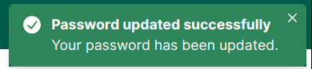](./img/guide-profile-img-16.png)

* You will receive this error if your passwords does not match.

    [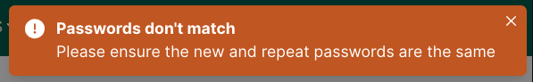](./img/guide-profile-img-17.png)

## How to Update Personnel Information?

This allows you to update your personal information, such as name, purpose, occupation, and country.

Fill the latest information you want to update and then click on the 1️⃣ `Update Info` button to update the information.

## How to Request Organisation?

Click on the 1️⃣ `Request Organisation` button to begin the process of requesting an organisation. Upon clicking, a new page will open, allowing you to join the organisation.

[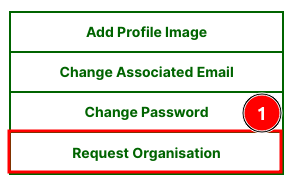](./img/guide-profile-img-3.png)

### Join Known Organisation

If you wish to join a already existing organisation, click on the 1️⃣ `Join Known Organisation` button to open the `Join Known Organisation` form. Fill in your 2️⃣ `First Name` and `Last Name`, then select the 3️⃣ `Organisation` from the dropdown list. To cancel the process, click on the 4️⃣ `Cancel` button. Otherwise, click on the 5️⃣ `Request` button to submit your request.

[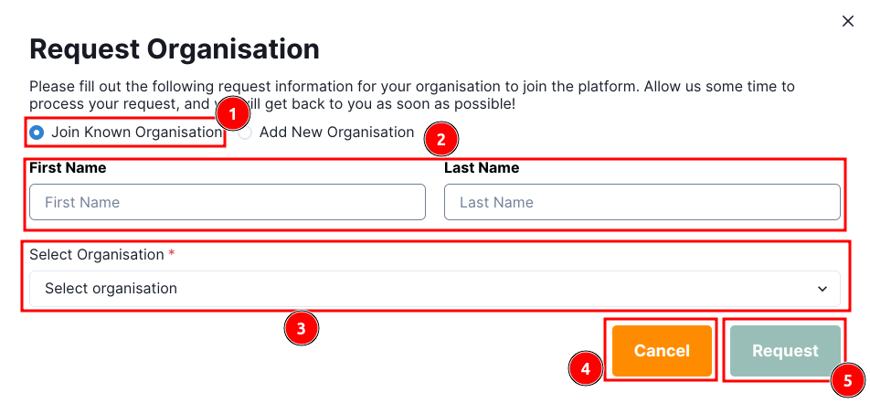](./img/guide-profile-img-4.png)

* **Error Notification:** If the request is not submitted successfully, an error 1️⃣ `Notification` will be displayed.

    [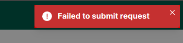](./img/guide-profile-img-8.png)

### Add New Organisation

To add a new organisation, click the 1️⃣ `Add New Organisation` button to open the `Add New Organisation` form. Enter your 2️⃣ `First Name` and `Last Name`, followed by the 3️⃣ `Organisation Name`, 4️⃣ `Organisation Email`, and 5️⃣ `Industry`. To cancel, click the 6️⃣ `Cancel` button. Otherwise, click the 7️⃣ `Request` button to submit your request.

[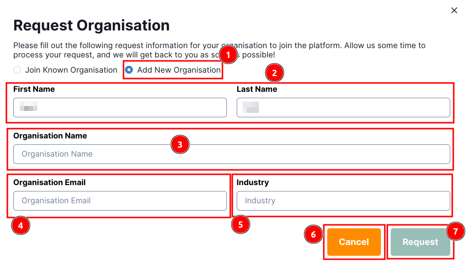](./img/guide-profile-img-9.png)
    
* **Error Notification:** If the request is not submitted successfully, an error 1️⃣ `Notification` will be displayed.

    

## How to Add New Member to The Organisation?

> Note: Only the organisation manager can add new members to the organisation.

When a user requests to join a known organisation, the organisation's manager receives a notification email containing the user's email address. The manager must approve the request to add the user as a member of the organisation.

Organisation managers are required to click on the 1️⃣ `Review Request` button, which redirects them to the admin panel.

[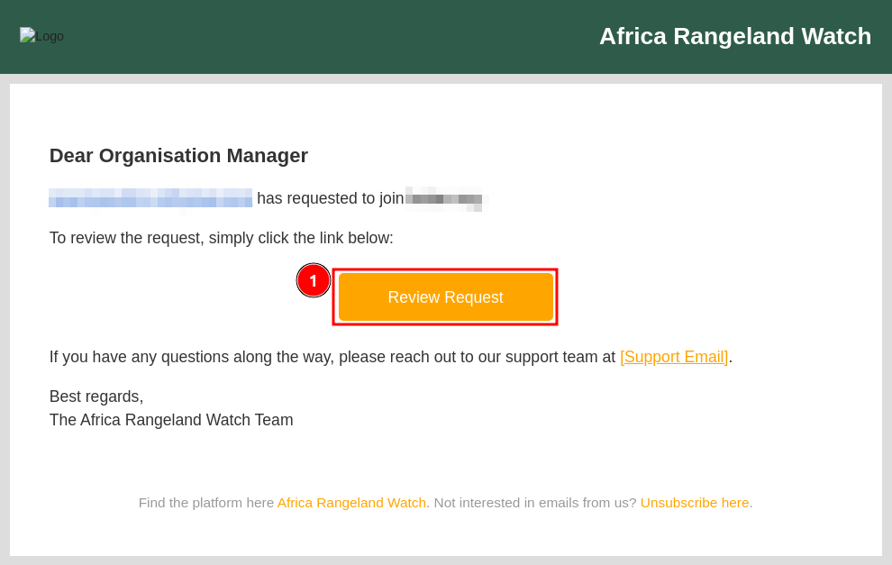](./img/guide-profile-img-10.png)

Click on the 1️⃣ `Organisation Invitations` to view all requests, then click on the 2️⃣ `User's Email` address to view their details.

[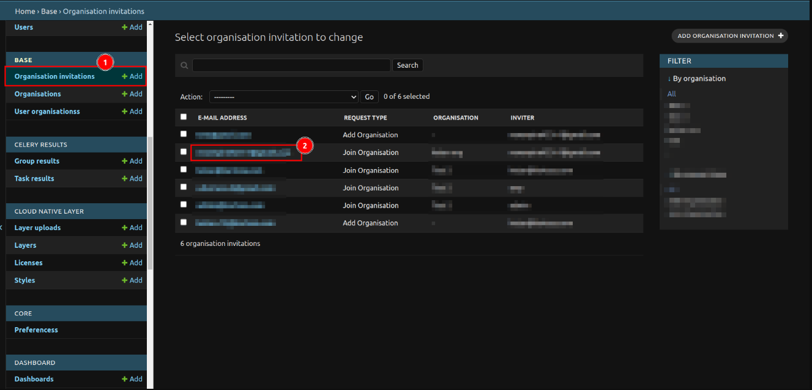](./img/guide-profile-img-11.png)

Click on the 1️⃣ `Accepted` checkbox, then scroll to the bottom and click the `SAVE` button to approve the user's request to join the organisation.

[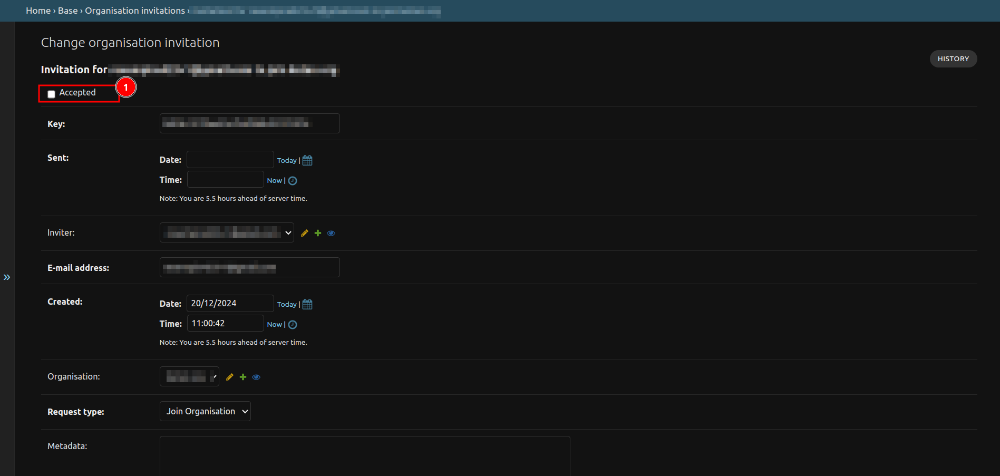](./img/guide-profile-img-12.png)
