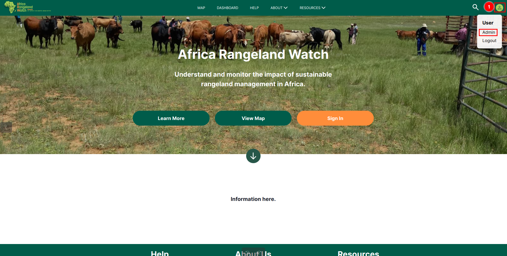

# User Guide: User Profile on Africa RangeLand Watch (ARW)

To access your profile, please click on the 1️⃣ `Profile icon` and select the `Admin` option.

After this you will be able to access the following pages:

* [Update Profile](./update-profile.md): This page allows you to update your profile information.

* [Organisation Information](./Organisation-information.md): This provides information about your the organisation.

* [My Dashboard](./Dashboard.md): This page provides an overview of the projects you are involved in.

* [Analysis Results](./Analysis-result.md): This page provides the results of the analysis.

* [Upload Resources](./Uploaded-resources.md): This page allows you to upload resources.

* [Support](./Support.md): This page provides information on how to get support.

* [Notification](./Notifications.md): This page provides information on how to manage notifications.

* [Sign Out](./Sign-out-user-profile.md): This option allows you to sign out of the system.