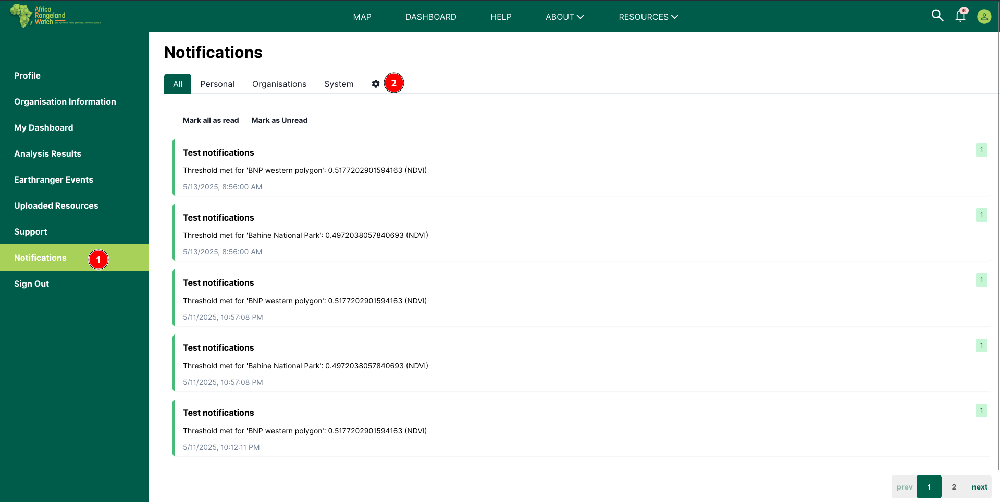
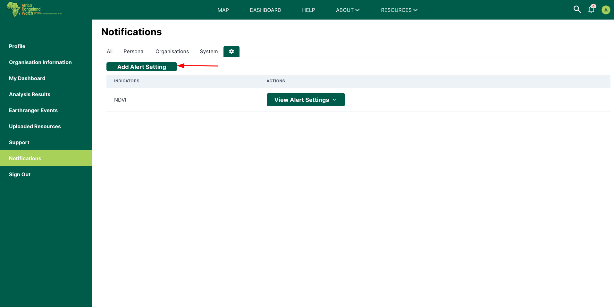
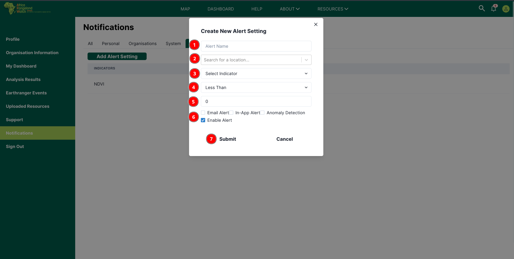
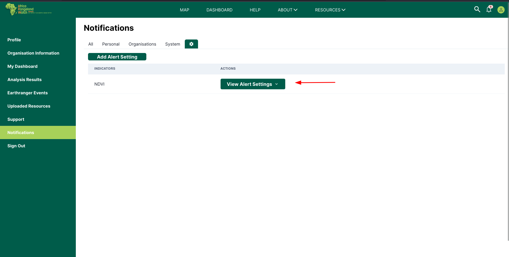
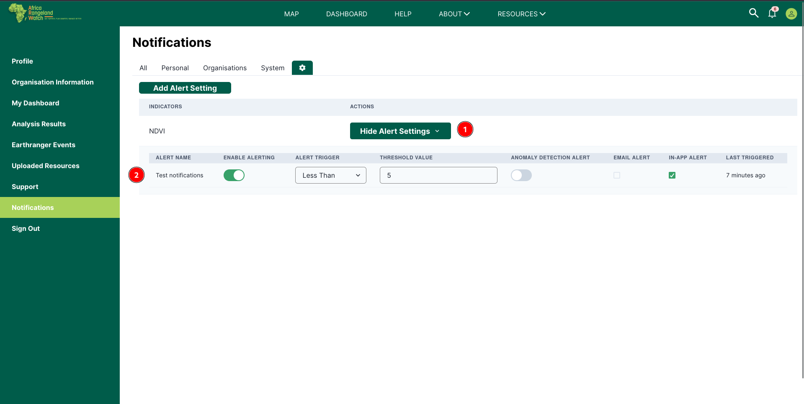

# Alert settings

Access the Alertsettings page from the user profile page. Click on the 1️⃣ `Alertsettings` tab from the left menu bar to access the Earthranger event page.

Click on the 2️⃣ `Settings` icon.

To add Alert settings, click on `Add Alert settings button`.
It will open up the form below.

To create an alert setting:

- 1️⃣ Set an alert name.
- 2️⃣ Search location for the specific alert.
- 3️⃣ Select the specific indicator
- 4️⃣ Select the necessary thresholds criteria
- 5️⃣ Set the threshold value
- 6️⃣ Enable alerts as desired.

You can the submit the data and your alert setting will be saved.

Alert settings are grouped by indicators.
To view your specific alert setting, click on `View Alert Settings` button.

You will be able to see your current active alert settings.

