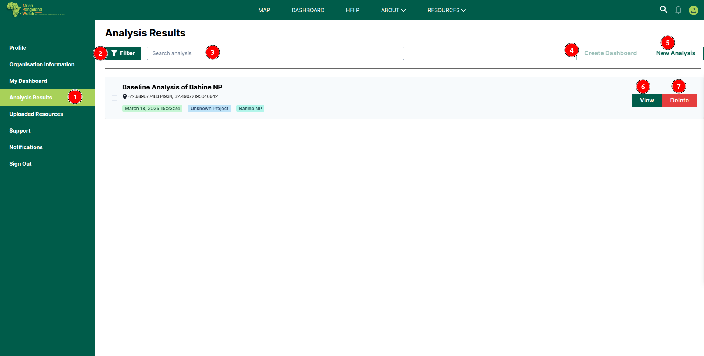

# Analysis Results: Africa RangeLand Watch (ARW)

1. **Analysis Results:** After clicking on this tab, users will be able to access the `Analysis Results` page.

2. **Filter:** Using this option, users can filter the data available on this page.

3. **Search:** Users can search for specific data using this search field.

4. **Create Dashboard:** Users can create a dashboard for their analysis results. This button is disabled by default to make this enable please select the analysis first.

5. **New Analysing:** Users can start a new analysis. This button will redirects the users to the map page.

6. **View:** By clicking on this button users can view the analysis report of the respective analysis.

    

    * **❎:** Click on this icon to close the report.

7. **Delete:** Users can delete the analysis by clicking on this button. This will open a delete confirmation dialog box.

    

    **1 Cancel:** Click on this button to cancel the deletion.

    **2 Yes, Delete:** Click on this button to delete the analysis.

## Filter Analysis

1. **Filter:** Click on this button to open the filter panel.

1. **Up arrow:** Click on this button to close the filter panel.

2. **Select Region:** Select region from the drop down menu.

3. **Select Date Range:** Select date range from the date field.

4. **Select Type:** Select type of analysis from the drop down menu.

5. **Clear Filter:** Click on this button to clear the filter.

## Create Dashboard

1. **Create Dashboard:** Click on this button to create a dashboard for the analysis results. This button is disable by default to make this enable please select the analysis first. After clicking on this button a dashboard creation form will appear.

1. **Dashboard Name:** Enter the name of the dashboard.

2. **Preferences:** Select the preferences for the dashboard.

3. **Access Level:** Select the access level from the dropdown menu.

4. **Save:** Click on this button to save the dashboard. After saving the form, the user will receive a success message, and the analysis will be added to the dashboard.
