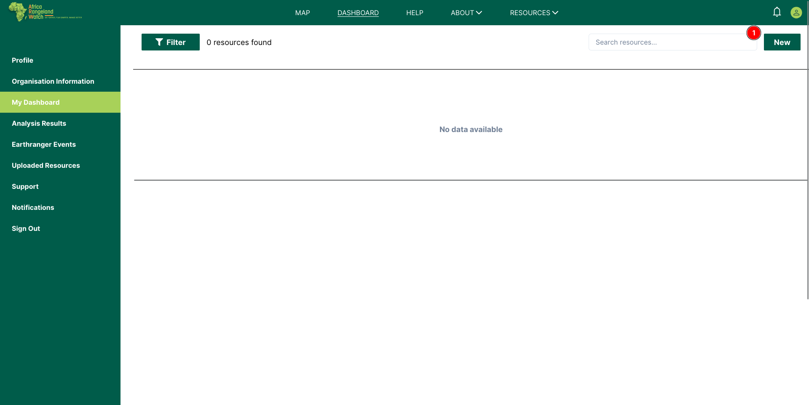
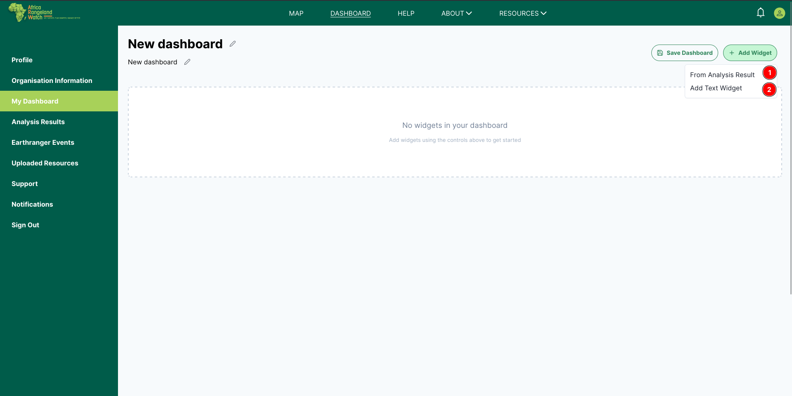

# Dashboard Page: Africa RangeLand Watch (ARW)

1. **DASHBOARD:** By clicking on this tab users will be able to access the dashboard page.

## Alternate way to access the dashboard page

1. **My Dashboard:** Users can also access the dashboard page by clicking on `My Dashboard` his tab from the user profile page.

* This is how it looks.

1. **Filter:** Users can use filter to narrow the result of the dashboard page.

2. **Resources Found:** Users can view the resources found on the dashboard page.

3. **Search resources:** Users can search for resources using the search bar.

4. **New:** Users can add new analysis to the dashboard by using this button.

5. **Organise by:** Users can organize the resources by clicking on the `Organise by`.

6. **Layout:** Allows users to change the layout to `Horizontal`, `Vertical` or `Nested`. Default is `Horizontal`.

    ### Vertical layout

    

    ### Nested layout

    

## Add New Dashboard

1. **Click New** on the Dashboard page.  
   

2. **Fill in the details** — Dashboard Name, Description (optional), and Access Level — then **Save**.  
   

3. Use **Add Widget → From Analysis Result** to insert the analysis as a widget (and add more if needed).
   
   

4. The **Choose an Analysis Result** panel appears. **Select** the saved analysis result and confirm.
   

5. The new dashboard is created.  
   

> Tip: If you don’t see your analysis in Step 4, run it on **MAP → Analysis** and click **Save Results** first.

## Explore Dashboard

1. **Settings:** Users can access the dashboard settings byc clicking on this setting icon.

    

    **1 Dashboard Name:** Users can change the name of the dashboard.

    **2 Dashboard Type** Users can change the type of the dashboard.

    **3 Associated Analysis Results:** Users can view the associated analysis results. They can also revert the associated analysis results by selecting the `Dashboard Analysis Results` and clicking on the `<-` icon, or vice versa.

    

    **4 Privacy Type:** Users can also change the privacy type of the dashboard.

    **5 Save Changes:** After making the necessary changes, users can click on the `Save Changes` button to save the changes.

2. **Download:** Users can click on icon to download the dashboard chart. This is how it looks.

    

3. **Delete Dashboard:** Click on this icon to delete the dashboard. After clicking on this button , users will be prompted to confirm the deletion.

    

    * **Cancel:** Click on this button to cancel the deletion.

    * **Yes, Delete:** Click on this button to confirm the deletion.
