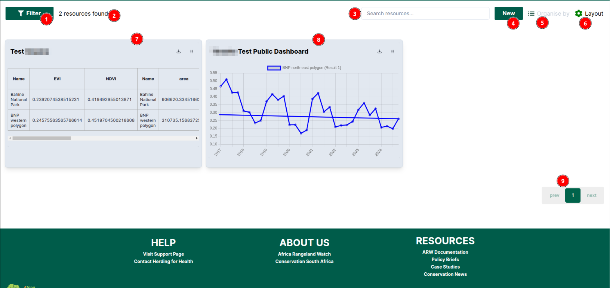

# Dashboard Page: Africa RangeLand Watch (ARW)

1. **DASHBOARD:** By clicking on this tab users will be able to access the dashboard page.

## Alternate way to access the dashboard page

1. **My Dashboard:** Users can also access the dashboard page by clicking on `My Dashboard` his tab from the user profile page.

* This is how it looks.

1. **Filter:** Users can use filter to narrow the result of the dashboard page.

2. **Search resources:** Users can search for resources using the search bar.

3. **New:** Users can add new resources by clicking on the `New` button.

4. **Organise by:** Users can organize the resources by clicking on the `Organise by`.

## Filter Resources

## Search Resources

## Add New Resource

## Organise by
