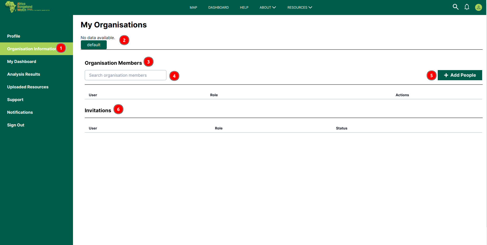
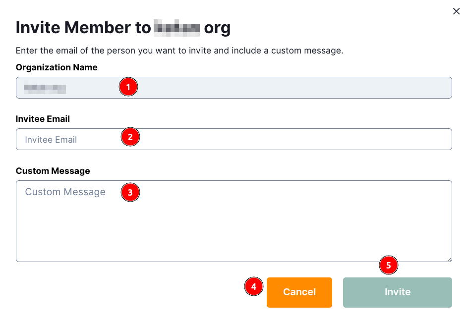
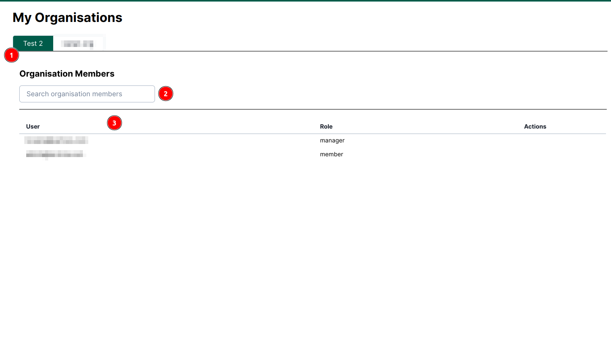

# Organisation Information: Africa RangeLand Watch (ARW)

1. **Organisation Information:** Clicking on this tab allows users to access the organisation's information page.

2. **Organisation Name:** Displays the name of the organisations.

3. **Organisation Member:** Displays the organisation member's information.

4. **Search:** Allows users to search for specific information within the organisation's data.

5. **Add People:** Allows users to add new people to the organisation.

    

    1 **Organisation Name:** Displays the name of the organisation.
    
    2 **Invitee Email:** Enter the email of the person to be added.

    3 **Custom Message:** Enter a custom message to be sent to the invitee.

    4 **Cancel:** Cancels the invitation.

    5 **Invite:** Sends the invitation to the invitee.  

6. **Invitations:** Displays the invitations sent to the organisation.

7. **Status:** Status Contains the status of the invitations.

    * **Joined:** It shows that the invitation has been accepted.

    * **PENDING:** It shows that the invitation is pending and needs to be reviewed.

## Join organisation as a member

If users join the organisation as members, they will see different tabs and options.

1. **Test 2:** Name of the organisation.

2. **Search organisation members:** Users can search for specific organisation members by using this search field.Enter the keyword in the search field and press the Enter key on the keyboard to search for organisation members.

3. **Organisation Members:** Displays the list of organisation members and managers with their corresponding roles and actions.
