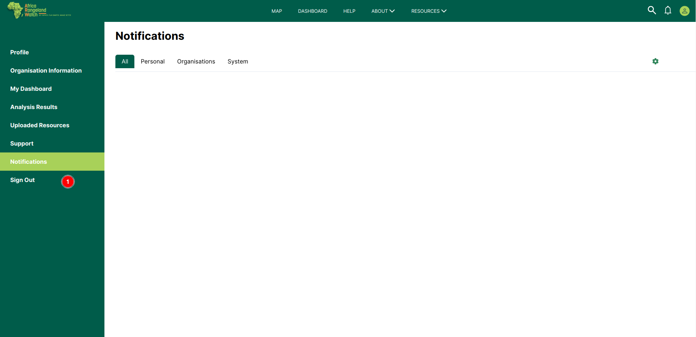
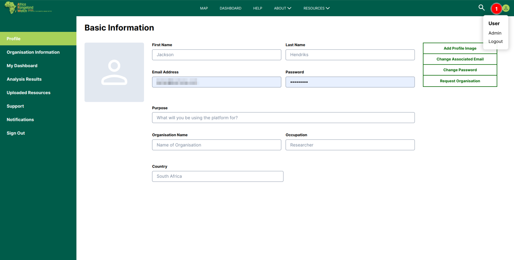

# Sign Out User Profile: Africa RangeLand Watch (ARW)

1. **Sign Out:** This option allows users to sign out from the ARW Site.

* Another way to sign out

    

1. **Profile Icon:** Click on the profile icon and then select the log out option, this will allows users to log out from the user profile.
