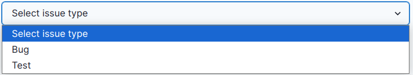

# Support Page: Africa RangeLand Watch (ARW)

1. **Support:** Click on this tab to access the support page of the ARW.

2. **Filter:** The filter feature enables users to organise tickets based on their preferences, making it easier to sort and view specific types of tickets.

3. **Search:** Allows users to search tickets.

    * For example, searching for `bug`.

        

4. **Create Ticket:** This button enables users to create a new ticket. By clicking on the `Create Ticket` button, a new form will appear.

    

    **1. Issue:** Allows users to select issue from the drop down menu.

    

    **2. Issue Title:** This input field enables users to provide descriptive title for their issue.        

    **3. Upload Attachments (Optional):** If user wants to provide any attachments about the issue, they can upload them here.

    **4. Additional Details:** This input field enables users to provide additional details about the issue.

    **5. Cancel:** Cancels the ticket creation process.

    **6. Submit:** Submits the ticket.

* After submitting the ticket, user will be redirect to the support page.

    

    1. **Ticket Created:** User will see a `Toast` notification with confirmation message `Your support ticket has been submitted`.

    * The newly created ticket will be added on the support page

## Upload Attachments

* This feature is optional.

    >Note: User can upload only 1 attachment in a single ticket.

    

    **1. Click on this input field to select the file to be uploaded.**

    
    
    * **Cancel:** Cancels the file upload process.
    
    * **Select:** After choosing the desired file users have to click on the `Select` button to complete the process.
    
    * **Image Files:** Type of files.
    
    * **✅ Checkbox:** Checking this box will allow users to open file in read only mode.
    
    * After completing the process image will be added to the attachments.

    
        
## Remove Attachments

        
**1. Remove:** Click on the `Remove` button to remove the attached file.
        

* Attached file removed successfully.

## Edit Attachments

**1. Input filed:** Click on this input field to select the file to be uploaded. This will open the file explorer to select the desired file.

    
* **Cancel:** Cancels the file upload process.
    
* **Select:** After choosing the desired file users have to click on the `Select` button to complete the process.
    
* **Image Files:** Type of files.
    
* **✅ Checkbox:** Checking this box will allow users to open file in read only mode.
    
* After completing the process attached file will be updated.

    
