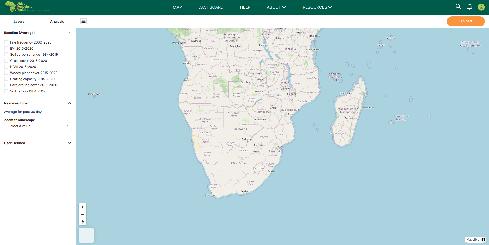

# Uploaded Resources: Africa RangeLand Watch (ARW)

1. **Uploaded Resources:** After clicking on this tab, users will be able to access the uploaded resources page.

2. **Filter:** Users can filter the uploaded results.

3. **Search:** Users can search for specific results.

4. **Add Data:** Users can also add new data to the uploaded resources page by clicking on this button.

5. **Zip:** This the zip file of the uploaded resources.

6. **View:** Users can view the uploaded resources by clicking on this button.

## Upload Resources

### Method 1: Using map page

Users can upload the resources from the map page by clicking on the `Upload` button.

To learn how to upload data from the map page, click [here](./map.md#how-to-upload-shape-file).

### Method 2: Using uploaded resources page
