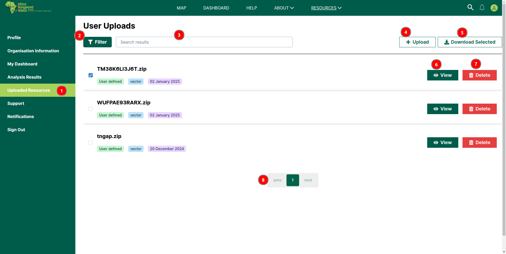

# Uploaded Resources: Africa RangeLand Watch (ARW)

1. **Uploaded Resources:** After clicking on this tab, users will be able to access the uploaded resources page.

2. **Filter:** Users can filter the uploaded resources.

    

    **1 Up Arrow:** Click on this to close this filter section.

    **2 Select Layer Type:** Users can select the type of layers from this dropdown menu.

    **3 Date:** Select the date range for which the resources are to be filtered.

    **4 Clear Filter:** Click on this button to clear the filter.

3. **Search:** Users can search for specific upload resources.

4. **Upload:** This button allows users to upload resources.

    

    **1 Upload:** Click on this button to upload the data.

    **2 X:** Click on this button to close the pop-up dialogue.

    **3 Select File:** Click on this button to upload the file.

    

    **1 Cancel:** Click on this button to cancel the upload.

    **2 Select:** After selecting the file click on this button to upload the file.

5. **Download Selected:** This button allows users to download the selected resources. This button is disabled until the user selects the resources.

6. **View:** Allows users to view the respective resource.

7. **Delete:** Allows users to delete the respective resource.

8. **Pagination:** Users can navigate through the uploaded resources using the pagination.

## Upload resources from the map page

Users can upload the resources from the map page by clicking on the `Upload` button.

To learn how to upload data from the map page, click [here](./map.md#how-to-upload-shape-file).
