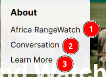
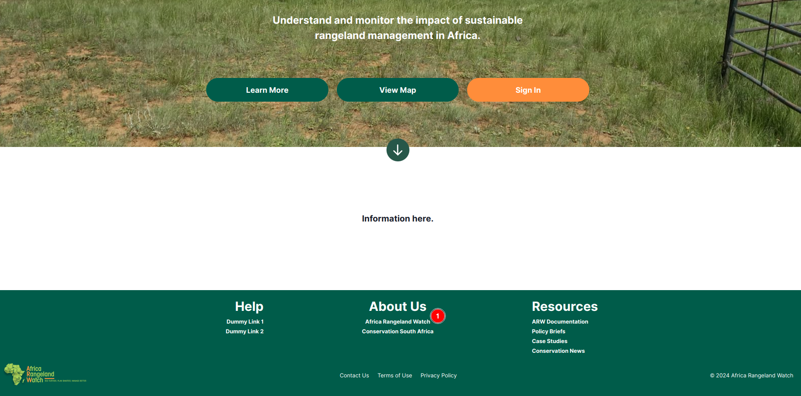
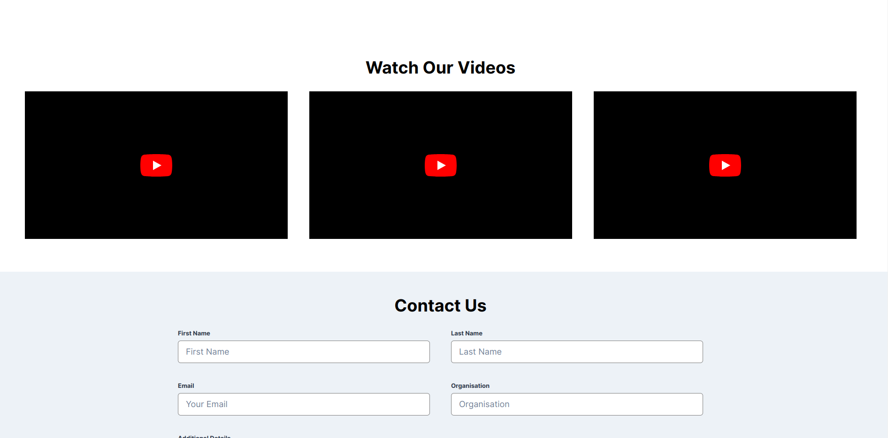

# About Page: Africa Rangeland Watch (ARW)

Welcome to the `About` page of the `Africa Rangeland Watch (ARW)`. This page provides a clear overview of the platform, its goals, and helpful information on how to make the best use of its features.

## About Page

1. **About:** In the navigation bar at the top of the page, users can locate the `About` link. Hovering over this link reveals a dropdown menu with the following options: `Africa RangeWatch`, `Conservation`, and `Learn More`.

    

    1. **Africa RangeWatch:** This option takes users to the `Africa RangeWatch` page, which provides an overview of the platform.

    Alternatively, users can access the `About` page using the footer section.

    

    **1. Africa Rangeland Watch:** This option takes users to the `About` page.
    
    This is how the `About` page appears.

    

    This about page is divided into several sections, each providing information on a different aspect of the platform.

    ### Basic Details

    

    ### Management Section

    This management section include `The Goal` section of the `Africa Rangeland Watch`.

    

    #### The Goal

    The Goal section outlines the primary objective of the platform, providing users with a clear understanding of its purpose and intended impact. It highlights the platform’s mission and the key outcomes it aims to achieve, offering insight into how the platform supports sustainable rangeland management and conservation efforts.

    * **Rangeland Monitoring:** How the platform supports rangeland monitoring and conservation efforts.

    * **Gather satellite data:** How the platform gathers satellite data to support rangeland monitoring and conservation efforts.

    * **Dashboard and Reporting:** How the platform provides a dashboard and reporting features to support rangeland monitoring and conservation efforts.

    * **Interactive map analysis:** How the platform provides interactive map analysis to support rangeland monitoring and conservation efforts.

    #### Videos

    

    #### Contact Us

    Contact us section allows users to get in touch with the team behind the platform.

    

    * **First Name:** Users can enter their first name.
    
    * **Last Name:** Users can enter their last name
    
    * **Email:** Users verified email address.
    
    * **Organisation:** The details about the organisation that wishes to contact the platform.
    
    * **Additional Details:** Users can enter any additional details they wish to share with the platform.

    * **Submit:** By clicking on this button user will bw able to submit their contact information to the platform.

