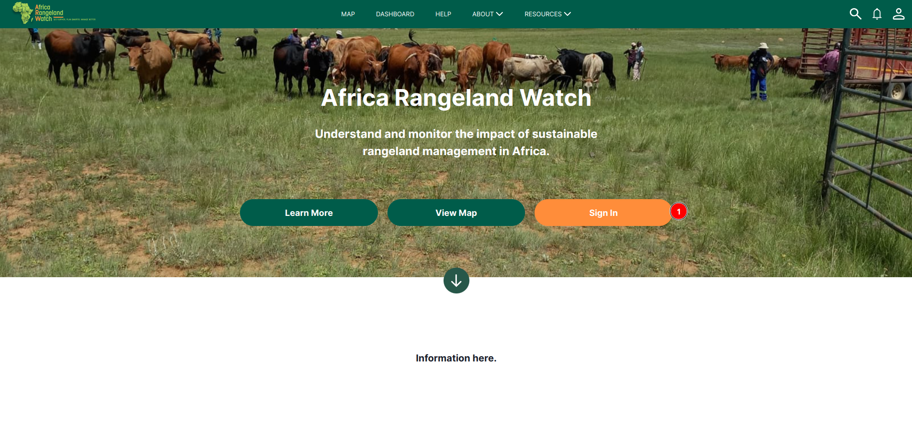
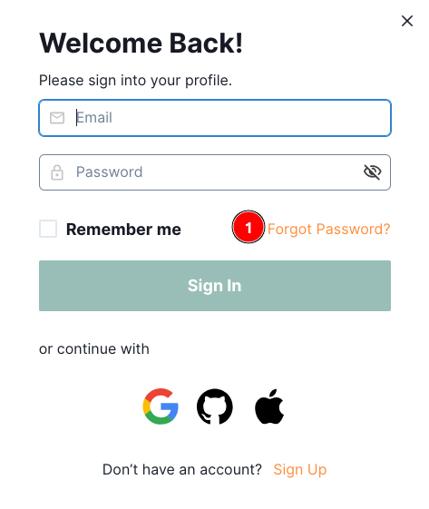
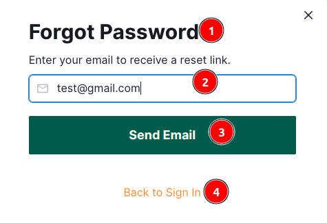
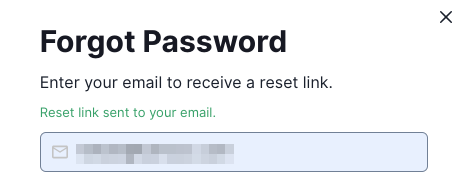
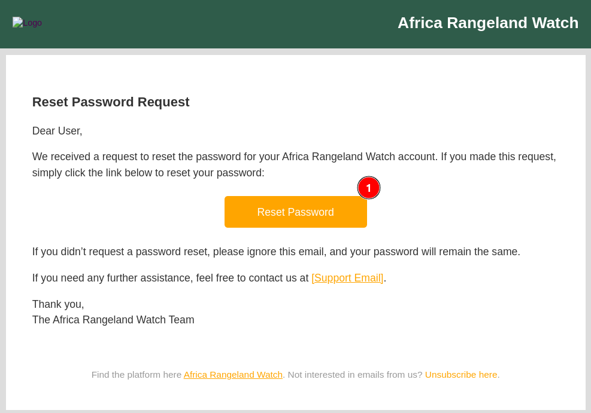
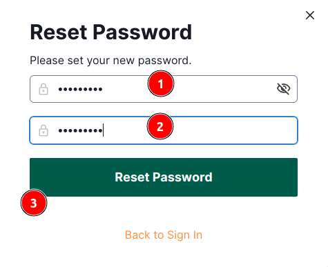
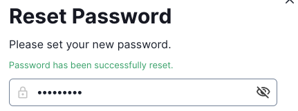
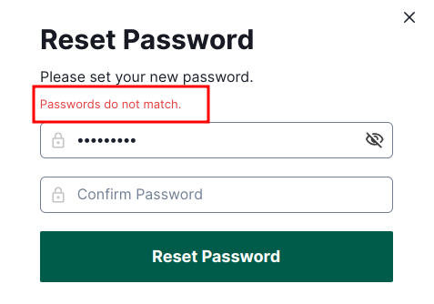
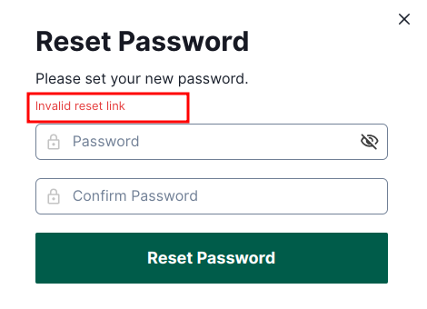

# User Manual: Forgot Password on Africa RangeLand Watch (ARW)

In case the user forgets their password, Africa Rangeland Watch (ARW) provides a convenient facility to reset it, allowing them to regain access to their account quickly and securely.

## Steps to reset the password

1. **Sign In:** Click on the `Sign In` button to navigate the sign-in page.

1. **Forgot Password:** Click on the `Forgot Password?` link to navigate to the password reset page.

1. Forgot Password Label
2. **Email:** Enter your registered email here.
3. **Send Email:** After entering your registered email address, click on the `Send Email` button to receive the password reset link in your inbox.

    

    * After clicking the submit button, users will be notified with a message: `Reset link sent to your email`.

        

        1 **Reset Password:** Clicking this button redirects users to the reset password page.

        

        1 **New Password:** Users are required to enter their new password here.

        2 **Confirm Password:** Enter the new password again to confirm it.

        3 **Reset Password:** After entering the new password and confirming it, click on the `Reset Password` button to complete the password reset process.  

        * After clicking on the `Reset Password` button users will be notified with a message: `Password has been successfully reset`.
            
            
        
        * **Passwords do not match:** If users forget to enter a password in any of the fields and click the Reset Password button, they will receive this error message.

            

        * **Invalid reset link:** If users forget to enter the password in both fields and click on the `Reset Password` button, they will receive this error message.

            

4. **Back to Sign In:** If you want to go back to the sign-in page, click on the `Back to Sign In` button.
