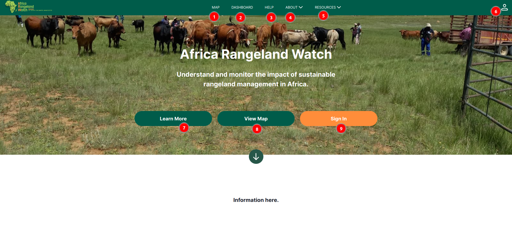
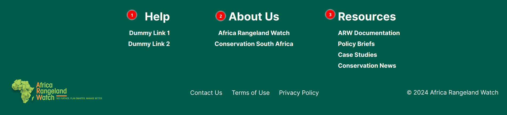

# Landing Page : Africa RangeLand Watch (ARW)

Welcome to the ARW Landing Page! This is your gateway to exploring and understanding the impact of sustainable rangeland management in Africa. The landing page offers a user-friendly interface, designed to guide you through your data exploration journey. Here, you can easily log in to your existing account, register for a new account, or learn more about the platform’s features and functionalities. Whether you're interested in monitoring rangeland health, exploring sustainable practices, or discovering data-driven insights, the ARW landing page is your starting point for making a difference in rangeland management.

## Landing Page Header and Navigation Bar

In the navigation bar, users will find several options to easily interact with the ARW site.

1. **MAP:** This button allows users to access the [interactive map](./map.md), where they can explore and visualize data related to sustainable rangeland management.

2. **DASHBOARD:** The Dashboard button in the header provides users with an overview of key metrics, insights, and visualisations related to sustainable rangeland management on the ARW platform.

3. **HELP:** The Help button in the header provides users with access to resources such as user guides, FAQs, and support contacts to assist with navigating and using the ARW platform effectively.

4. **ABOUT:** The About button gives users an overview of the ARW platform, its mission, vision, and the team behind it, offering insight into the platform's purpose and the impact it aims to achieve.

5. **RESOURCES:** The Resources button provides users with access to helpful materials, including guides, documentation, FAQs, and other tools that assist in navigating and utilising the ARW platform effectively.

6. **PROFILE Icon:** Allows user to register or login to their account.

7. **Learn More:** The Learn More button directs users to additional information or resources that offer a deeper understanding of the ARW platform, its features, and how it can be utilised for data exploration and sustainable rangeland management.

8. **View Map:** The View Map button allows users to access the interactive map, where they can visualise and explore various geographical data points, project instances, and site observations on the ARW platform.

9. **Sign In:** Allows user to login to their account.

## Landing Page Footer

1. **Help:** The Help button in the header provides users with access to resources such as user guides, FAQs, and support contacts to assist with navigating and using the ARW platform effectively.

2. **About Us:** The About button gives users an overview of the ARW platform, its mission, vision, and the team behind it, offering insight into the platform's purpose and the impact it aims to achieve.

3. **Resources:** The Resources button provides users with access to helpful materials, including guides, documentation, FAQs, and other tools that assist in navigating and utilising the ARW platform effectively.
