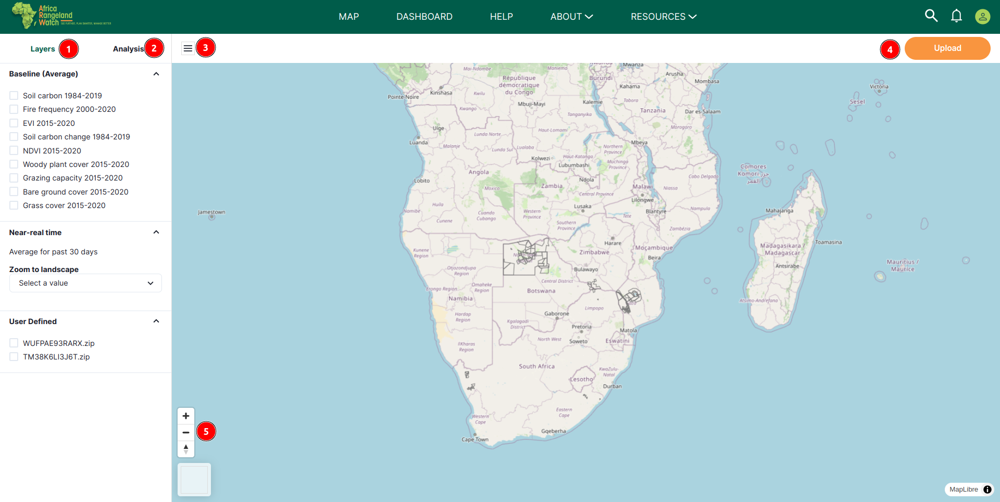
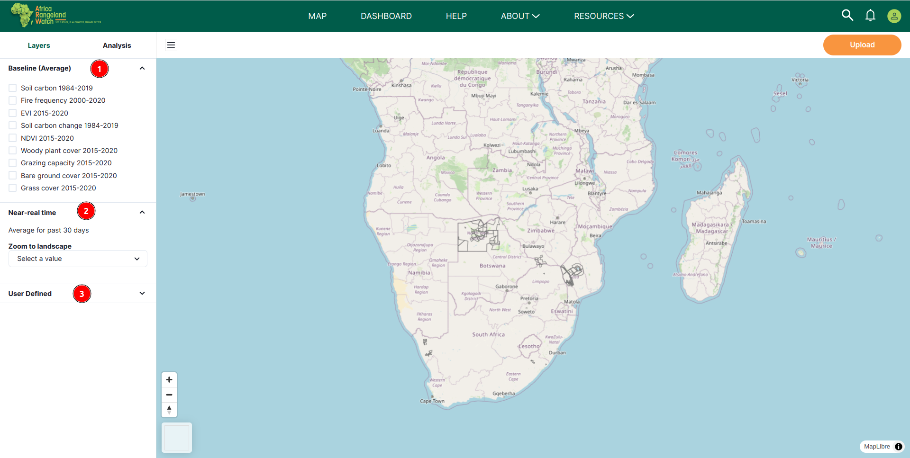
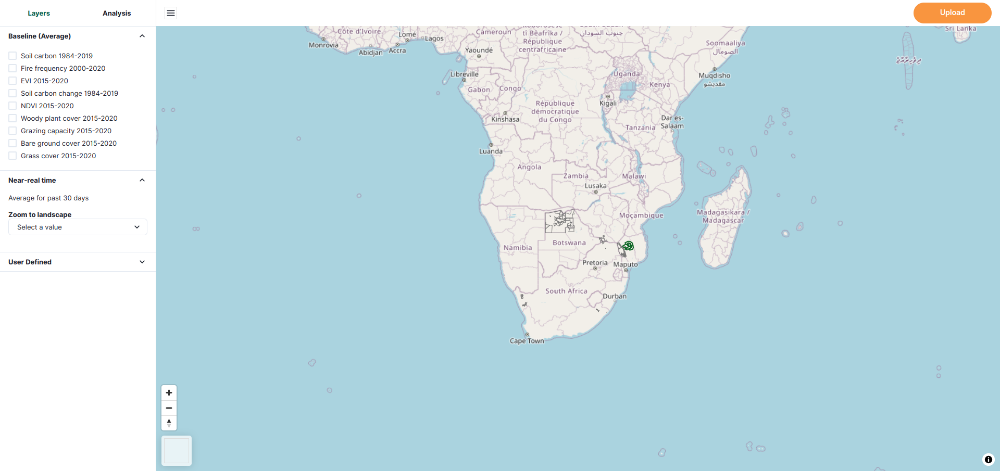
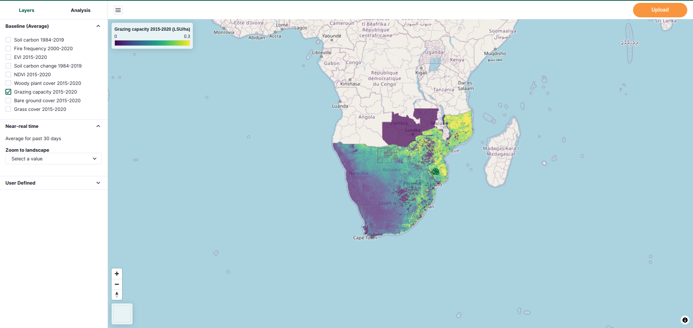
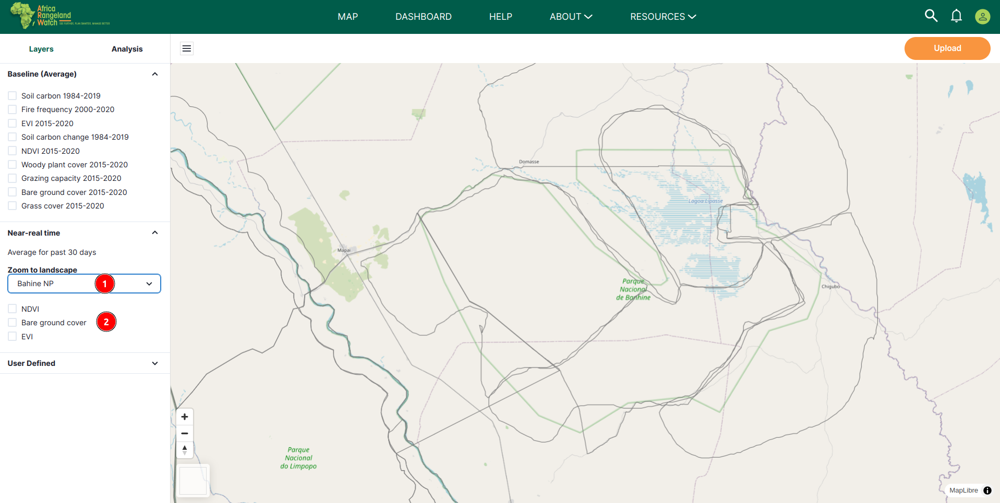
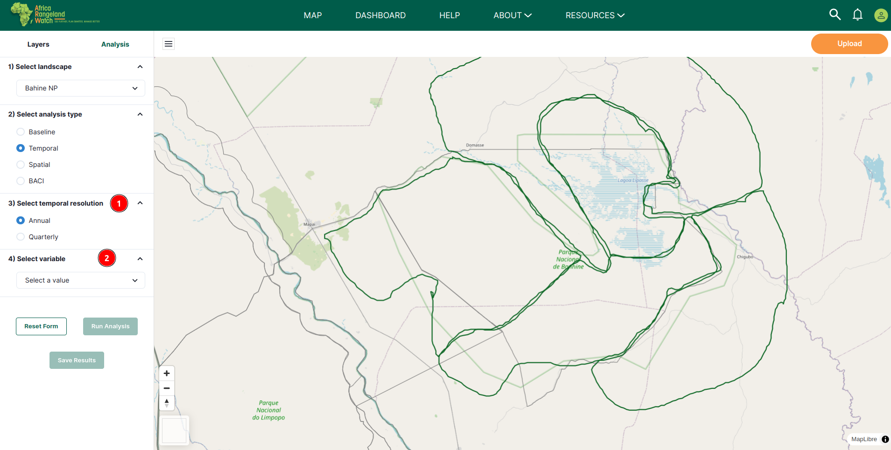
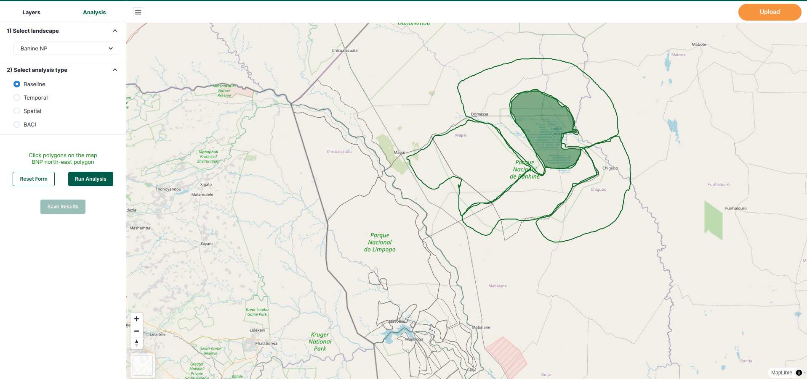
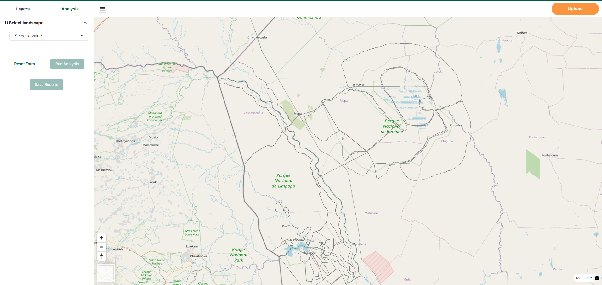

# MAP: Africa RangeLand Watch (ARW)

1. **MAP:** Click on the MAP option in the navigation bar to view the map.

1. **Layers:** Allows users to apply various layers to the map, providing the flexibility to customise and enhance the map's visual representation. This functionality enables users to modify how data is displayed, making it easier to interpret and focus on specific details or patterns that are relevant to their analysis.

    
    
    **1. Baseline(Average):** Baseline describes a 5-year (and in some cases longer) average of each variable. Baseline variables are visible at the whole extent of southern Africa. Users have the option to select multiple baseline years from the dropdown menu by simply checking the corresponding boxes. This allows them to include data from different years for the analysis, providing a comprehensive view of changes over time.

    * Apply Baseline(Average) layer by clicking on the checkbox next to Baseline(Average) in the Layers section.

    * Before applying the Baseline(Average) layer.

        

    * After applying the Baseline(Average) layer.

        

        

    * Apply multiple Baseline(Average) layers simultaneously.

        

        > Note: Users can apply multiple baseline layers, the map shows data for all selected layers. However, the most recently applied layer is displayed more clearly for better visibility.

    **2. Near-real time:** Near-real-time data provides users with the average of the last 30 days, offering insights into recent changes and trends for effective monitoring.

    

    **1. Zoom to landscape:** Allows users to select a specific landscape from the dropdown menu. This feature enables users to focus on specific regions of interest, making it easier to analyse.

    * For example: Zooming on the `Limpopo NP` landscape.

        

    **2. Variables:** Variables are those that are used to compute temporal and spatial statistics for different areas within the app. Users can apply the variable of their choice by checking the corresponding checkbox.

    > Note: Users can select multiple variables simultaneously, and the map will display data for all selected variables. However, the most recently applied variable will be highlighted for improved visibility. 

    * **EVI:** The enhanced vegetation index (EVI) is a spectral index calculated from satellite data in the near-infrared, red and blue wavelengths (Liu and Huete, 1995). EVI is a good proxy for vegetation vigour, greenness, biomass and cover. Relative to NDVI (see below), EVI simultaneously corrects for atmospheric and soil effects and does not saturate over high vegetation biomass. It has been used to map rangeland restoration and degradation trends over South Africa in Venter et al., 2020. We calculate baseline EVI at 250m resolution from the MOD13Q1 dataset derived from the MODIS satellites. For NRT and analysis EVI at the landscape scale, we calculate EVI from cloud-masked mosaics of Sentinel-2 imagery at 10m resolution.

        

    * **NDVI:** The normalised difference vegetation index (NDVI) is very similar to the EVI however it is more sensitive to sparse vegetation (Tucker 1979). It is therefore good for use in arid areas where one does not expect high levels of vegetation greenness. We calculate baseline EVI at 250m resolution from the MOD13Q1 dataset derived from the MODIS satellites. For NRT and analysis of EVI at the landscape scale, we calculate EVI from cloud-masked mosaics of Sentinel-2 imagery at 10m resolution.

        

    * **Bare ground cover:** Bare ground cover refers to the proportion of the landscape where the surface is exposed without significant vegetation, such as grass or woody plants. These areas may consist of soil, sand, or rock and are important in ecological assessments as they affect processes like erosion, water infiltration, and habitat stability.
        
        

    **3. User Defined:** allows users to view the shape files they have uploaded. Users can also apply their shape files onn the checking the corresponding checkbox.

2. **Analysis:** This section allows users to perform analyses based on various conditions and run the analysis on the map to visualise the results.

    

    **1. Select a landscape:** Choose a landscape from the dropdown menu to focus on a specific region. After selecting a landscape, users can proceed to the next step.

    

    * When users select a landscape, the map zooms into the selected area. From there, they can choose a polygon on the map to run the desired analysis.

        - **For example:**

            - If a user selects `Bahine NP` from the landscape drop-down menu, they will automatically be zoomed into that location on the map, eliminating the need to navigate to it manually.

                

    **2. Select analysis type:** Analysis type allows to select the type of analysis to be performed. The available options are:

    **1. Baseline:** Baseline describes a 5-year (and in some cases longer) average of each variable. Baseline variables are visible at the whole extent of southern Africa. After this user have to select the polygon from the map.

    **2. Temporal:** Temporal analysis gives users greater control over the time period they wish to examine. After selecting this option, users can access additional settings.

    

    **1. Select temporal resolution:** This option enables users to customise the time period by selecting either an Annual or Quarterly timeframe, based on users needs.

    **2. Select variables:** variables are those that are used to compute temporal and spatial statistics for different areas within the app.

    

    - **EVI:** The Enhanced Vegetation Index (EVI) is a satellite-derived metric used to measure vegetation health, greenness, and biomass.

    - **NDVI:** The Normalised Difference Vegetation Index (NDVI) is similar to the Enhanced Vegetation Index (EVI) but is more sensitive to sparse vegetation, making it ideal for monitoring arid regions with low vegetation greenness.

    - **Bare ground cover:**  Bare ground cover refers to the proportion of the landscape where the surface is exposed without significant vegetation, such as grass or woody plants. These areas may consist of soil, sand, or rock and are important in ecological assessments as they affect processes like erosion, water infiltration, and habitat stability.

    - After selecting the variable, user will be able to select the time period.

        

        **1. Select reference period:** This option allows users to choose a reference period for comparison. After this user will be able to select comparison period.

        **2. Select comparison period:** This option allows users to choose a comparison period for comparison with the reference period.

        **3. Select quarter:** Allows users to select the specific quarter of the year. This option is only available when the temporal resolution is set to quarterly.

        **3. Spatial:** After selecting this option, the user can choose the desired variable, select a polygon from the map, and proceed to run the analysis.

        

        **4. BACI:** BACI (Before-After-Control-Impact) evaluates land management effects by comparing changes over time between impacted and control areas.

        **5. Run Analysis:** Users are required to select the polygon before running the analysis.

        * **Select polygon:** To select a polygon, users need to click on the desired polygon after choosing the landscape. Users can only select one polygon at a time.

            

            **1 Landscape:** For example, we have selected the `Bahine NP` landscape.

            **2 Polygons:** The highlighted area displays the available polygons within the selected landscape. 

            **3 Click polygon the map:** This description provides users with the location of the polygon, specifying whether it is situated in the eastern, northern, western, or southern section of the landscape.

            

            * After successfully running the analysis, the user will be able to view the results in the statistics pop up. The `Statistics` table provides quantitative data for the selected polygon. It includes the following columns: Name, EVI, and Bare Ground % etc.

                

        **6. Reset From:** This option allows users to reset the form to its default state, including the selected polygon.

        

3. **Upload:** Users can upload their own data to the app for analysis. This feature is useful for users who have their own data and want to perform analysis on it. Click on this `Upload` button to upload the shape file.

    

    * **Select File:** Click on the `Select File` button to select the shape file from the local computer.

        

        1 **Cancel:** Click on this button close the file explorer.

        2 **File:** Select the desired file.

        3 **Select:** After selecting the file click on this button to upload the file.

    * **X:** Click on this `X` button to cancel the upload process.

4. :** This button allows user to hide the left menu.

    

5. ➕ and ➖ buttons:** These buttons allow users to zoom in and out of the map.

    
