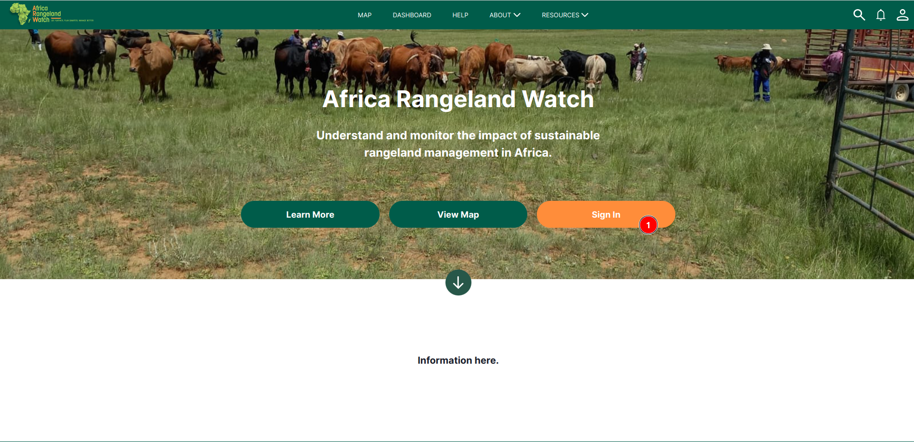
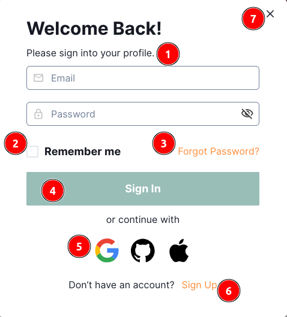
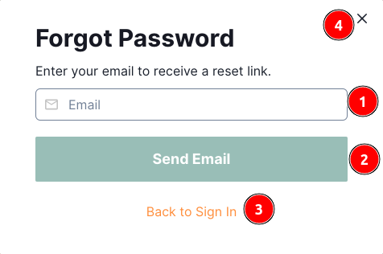
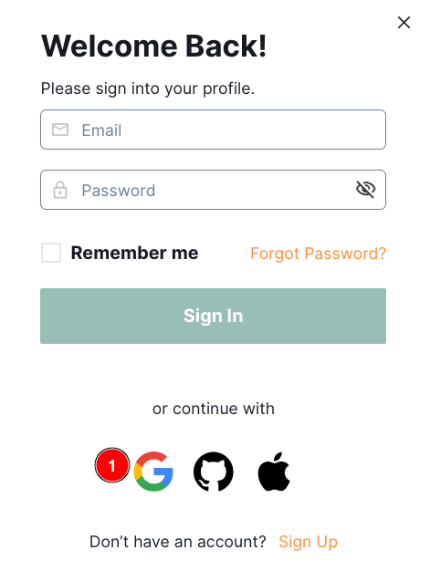
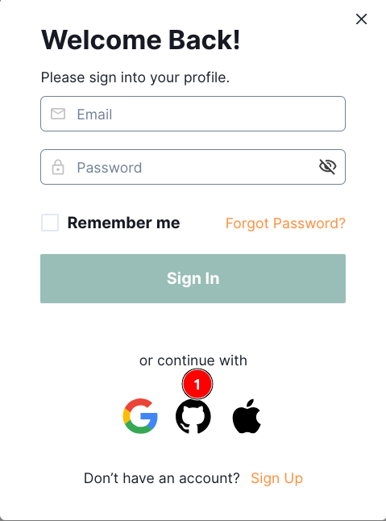
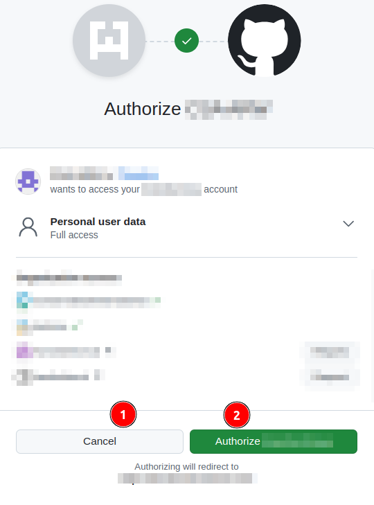
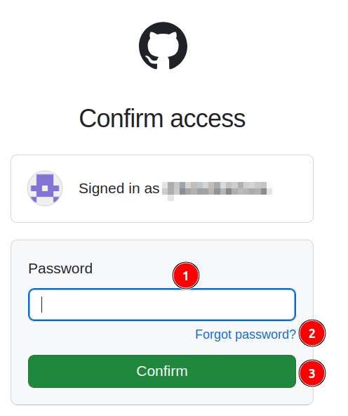

---
title: PROJECT_TITLE
summary: PROJECT_SUMMARY
    - PERSON_1
    - PERSON_2
date: DATE
some_url: PROJECT_GITHUB_URL
copyright: Copyright 2023, PROJECT_OWNER
contact: PROJECT_CONTACT
license: This program is free software; you can redistribute it and/or modify it under the terms of the GNU Affero General Public License as published by the Free Software Foundation; either version 3 of the License, or (at your option) any later version.
--- 

# User Manual: Sign-In on Africa RangeLand Watch (ARW)

Welcome to the ARW sign-in user manual. This guide provides step-by-step instructions on how to sign in to the ARW website.

1. **Sign In:** Click on the `Sign In` button to go to the sign-in page.

1. **Form Fields:** Fill the following information in the form to complete the sign-in process.

    - **Email:** Enter your registered email address.
    - **Password:** Enter the password you created during the sign-up process.

2. **Remember me:** If you want to stay signed in on this device, check the `Remember me` box.

3. **Forgot Password:** In case you forgot your password, click on the `Forgot Password` link to reset it. This will open a new form.

    

    **1. Email:** Enter the email address associated with your account.

    **2. Send Email:** Click on the `Send Email` button to receive a password reset email.
    
    **3. Back to Sign In:** Click on the `Back to Sign In` button to return to the sign-in page.    

    **4. x:** Click on the `x` button to close the password reset form.

4. **Sign In:** Click on the `Sign In` button to complete the sign-in process.

5. **Other Accounts:** You can also sign in using your other accounts like  accounts.

6. **Sign Up:** If you don't have an account, click on the `Sign Up` button to create one.

7. **x:** Click on the `x` button to close the sign-in form.

* To see how to create an account click on the [Sign-up](./sign-up.md)

## Sign-in using Google

1. **Google:** Click on the `Google` icon to sign in with the `Google` account.

## Sign-in using Github

>Note: For the first time users are required to follow these steps.

1. **Github:** Click on the `Github` icon to sign in with the `Github` account.

1. **Cancel:** Click on the `Cancel` button to cancel the sign-in process.

2. **Authorize:** Click on the `Authorize` button to authorize the `Github` account.

1. **Password:** Users are required to enter their github password to confirm the access.

2. **Forgot Password:** If the user forgets their password, click on the `Forgot Password` link to reset it.

3. **Confirm:** Click on the `Confirm` button to confirm the access.

After confirming the access, the user will be redirected to the ARW home page.
