---
title: PROJECT_TITLE
summary: PROJECT_SUMMARY
    - PERSON_1
    - PERSON_2
date: DATE
some_url: PROJECT_GITHUB_URL
copyright: Copyright 2023, PROJECT_OWNER
contact: PROJECT_CONTACT
license: This program is free software; you can redistribute it and/or modify it under the terms of the GNU Affero General Public License as published by the Free Software Foundation; either version 3 of the License, or (at your option) any later version.
--- 

# User Manual: Sign-Up on Africa RangeLand Watch (ARW)

## Introduction 

The ARW allows user to create account and sign up for the platform. This user manual will guide users through the process of signing up on ARW. 

## Accessing the Signup page

[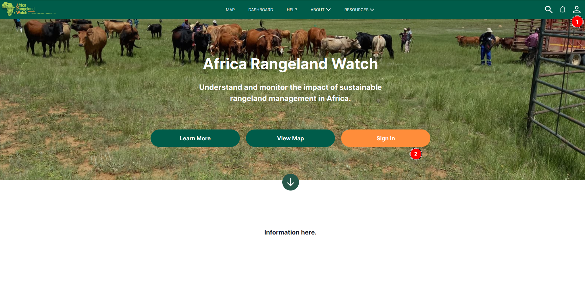](./img/signup-img-1.png)

1. Click on the `Profile icon` in the top right corner to access the sign-up form.

2. **Sign In:** Users can also click on the `Sign in` to access the sign-up page.

[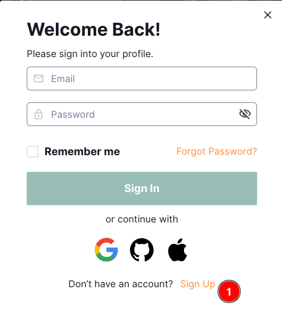](./img/signup-img-3.png)

1. **Sign Up:** Click on the `Sign up` button to access the sign-up form.

## Sign Up with the new account 

[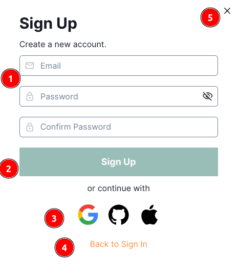](./img/signup-img-4.png)

Here are two options to sign up for a new account:

1. **Form field:** ARW sign-up form allows user to create a new account by entering the necessary information.

    - **Email:** Users are required to enter a valid email address.
    - **Password:** Users are required to enter a password that meets the password requirements.
    - **Confirm Password:** Re-enter the password to confirm it.

2. **Sign-Up:** Click on the `Sign Up` button to complete the registration process. A verification email will be sent to the email address entered by the user.

    [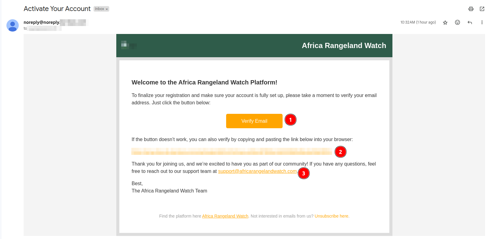](./img/signup-img-5.png)

    1 **Verify Email:** Click on the `Verify Email` button to verify the email.

    2 **Link:** If anu can `Verify Email` button does not work, user can click on the link to verify the email.

    * After clicking on either of the above options, the user will be redirected to the `ARW` home page.

        [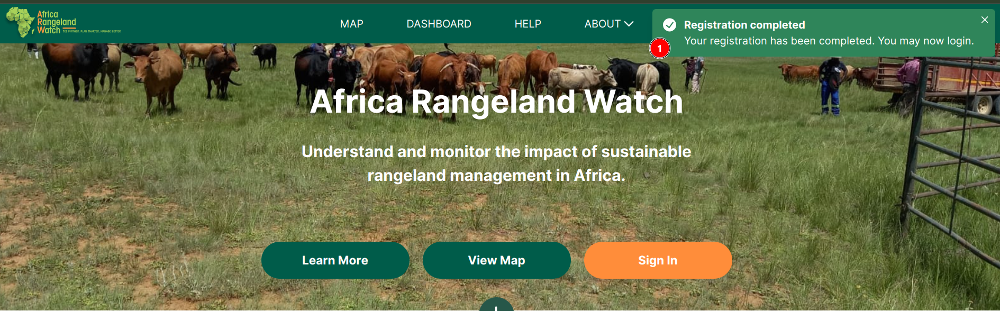](./img/signup-img-6.png)

        1 **Notification Toast:** A notification toast will appear, confirming that the user's `Registration completed`. After this user will be able to login in their account.

    3 **Support:** If users have any questions, they can reach out to the support team by clicking on this link. This link will open a message window.

    [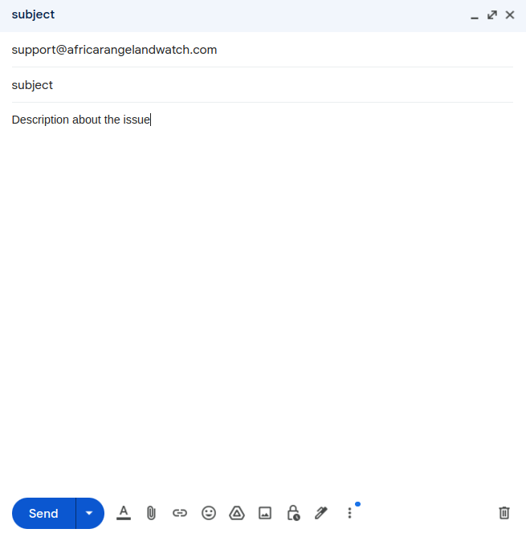](./img/signup-img-7.png)

    * After providing the subject and description of the issue, users can click the `Send` button to submit or select the `X` button to close the window.

3. **Other Accounts:** User can also use other accounts like google, github and apple to sign-up.

4. **Back to Sign In:** Click on the `Back to Sign In` button to go back to the sign-in page.

5. **x:** By clicking on this button users can close the form.

## Sign-up using google

[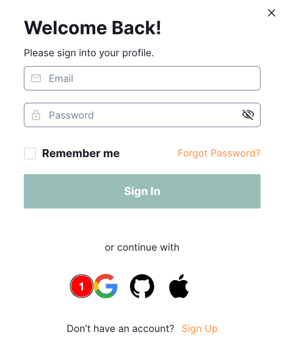](./img/signup-img-8.png)

1. **Google:** Click on this icon to sign up using Google.

[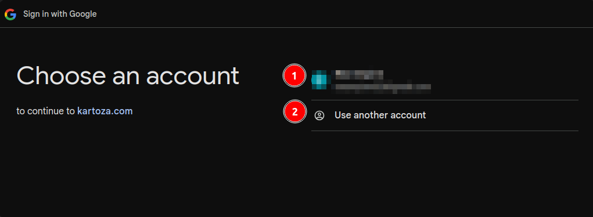](./img/signup-img-9.png)

1. **Account:** Click on the account to sign up.

2. **Use another account:** If the user wants to use another account, they can click on this link.

[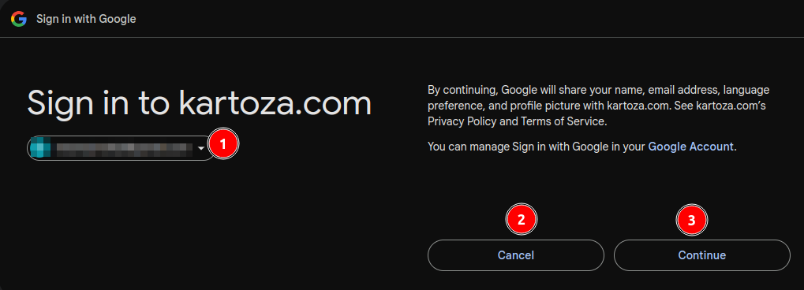](./img/signup-img-10.png)

1. **Account:** Users can see there current selected account.

2. **Cancel:** Click on this button to cancel the sign up process.

3. **Continue:** Click on this button to continue the sign up process.

* After clicking on the `Continue` button, the user will be redirected to the `ARW` profile page.

## Sign-up using github

[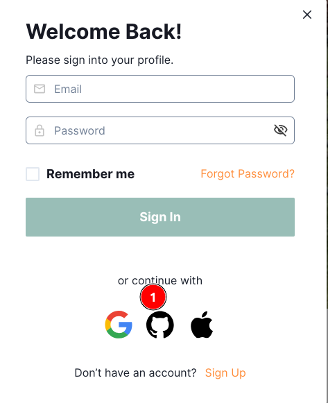](./img/signup-img-11.png)

1. **Github:** Click on this icon to sign up using Github.

[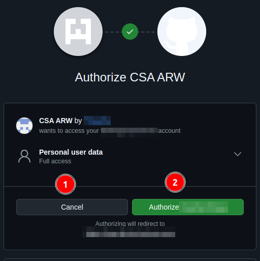](./img/signup-img-12.png)

1. **Cancel:** Click on this button to cancel the sign up process.

2. **Authorise:** Click on this button to authorise the sign up process.

* After completing the sign up process, the users will be redirected to the `ARW` home page.

- Click on the [signing](./sign-in.md) to see the signing process.
