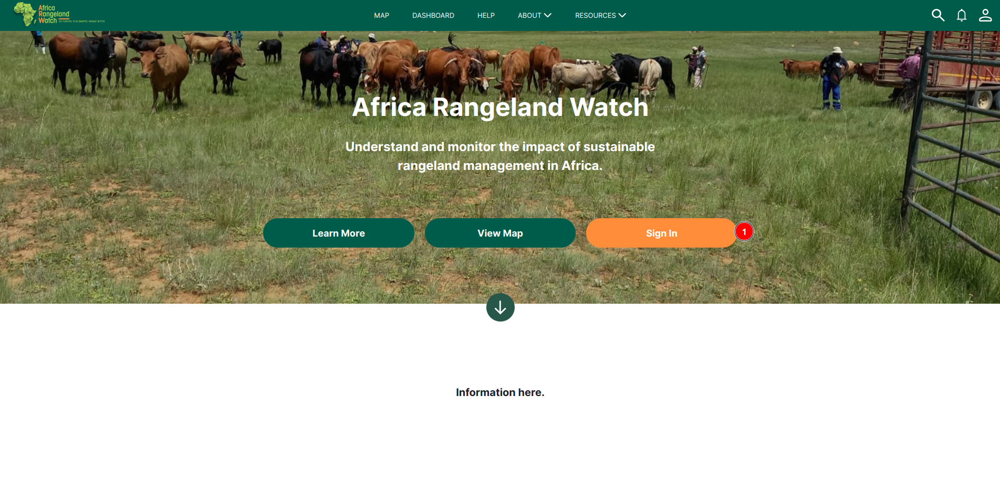
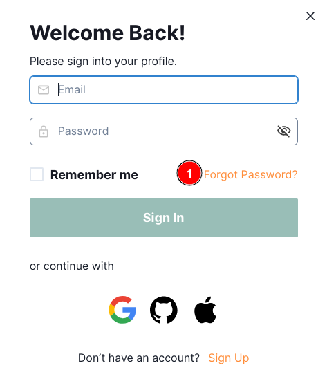

# Forgot Password

In case the user forgets their password, Africa Rangeland Watch (ARW) provides a convenient facility to reset it, allowing them to regain access to their account quickly and securely.

## Steps to reset the password

- Visit the [ARW site](https://arw.sta.do.kartoza.com/).

1. **Sign In:** Click on the `Sign In` button to navigate the sign-in page.

1. **Forgot Password:** Click on the `Forgot Password?` link to navigate to the password reset page.

1. Forgot Password Label
2. **Email:** Enter your registered email here.
3. **Send Email:** After entering your registered email address, click on the `Send Email` button to receive the password reset link in your inbox.
4. **Back to Sign In:** If you want to go back to the sign-in page, click on the `Back to Sign In` button.
