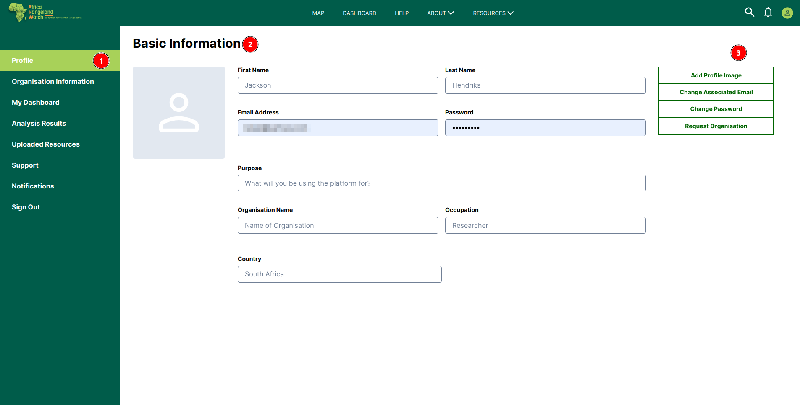
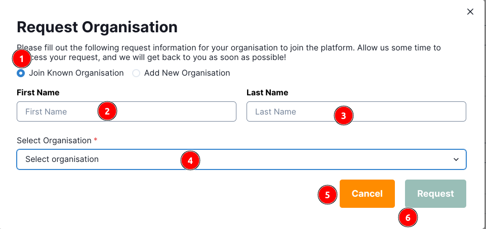

# Profile Page: Africa RangeLand Watch (ARW)

1. **Profile:** Click on this tab to view the user profile on the Africa RangeLand Watch (ARW).

2. **Basic Information:** This section contains the basic information about the user.

    

    * **First Name:** First name of the user.
    * **Last Name:** Last name of the user.
    * **Email:** Email address of the user.
    * **Password:** Password of the user.
    * **Purpose:** What will you be using the platform for?
    * **Occupation:** What is your occupation?
    * **Country:** Where are you located?

3. **Edit Profile:** This section allows you to edit your profile.

    

    * **Add Profile Image:** Allows you to add a profile image.

    * **Change Associated Email:** Allows you to change the email associated with your account.

    * **Change Password:** Allows you to change your password.

    * **Request Organisation:** Allows you to request to join an organisation.

## Add Profile Image

1. **Profile Icon:** Click on this icon to add a profile image. This will open a file explorer where users can select an image from their device.

    

    1 **File:** This is the desired image to be uploaded.
    
    2 **Select:** Users are required to click on this button upload the image.

    3 **Cancel:** Users can use this button to cancel the process.

2. **Update Profile:** After selecting the image, click on this button to update the profile image.

    * **Success Notification:** A notification toast will appear confirming the successful update of the profile image.

        

    * **Error Notification:** If the user click on the `Update Profile` button without selecting the image, an error notification will appear.

        

## Change Associated Email

## Change Password

1. **Change Password:** Click on this button to change the password. This will open a form where users can enter their new password.

    

    1 **Current Password:** Users are required to enter their current password.

    2 **New Password:** Users are required to enter their new password.

    3 **Repeat New Password:** Users are required to confirm their new password.

    4 **Update:** Users are required to click on this button to update their password.

    * Users will receive this error message if they enter an incorrect current password.
        
        

    * Users will receive this success message if they successfully update their password.

        

    * Users will see this error message if the entered passwords do not match..

          

## Update Personnel Information

Allows users to update their personal information, such as name, purpose, occupation, and country.

  

1. **Update Info:** After filling in the latest information users will be able to click on this button to update their information.

## Request Organisation

1. **Request Organisation:** This option enables users to submit a request for their organisation to join the ARW platform.

### Join Known Organisation

If users wants to join an organisation that is already on the ARW platform, they can use this option.

1. **Join Known Organisation:** Click on this radio button to access the `Join Known Organisation` form.

2. **First Name:** Users are required to enter their first name.

3. **Last Name:** Users are required to enter their last name.

4. **Select organisation:** Click the `Select Organisation` field to open the dropdown menu and choose the organisation to join.

5. **Cancel:** Users can use this button to cancel the process.

6. **Request:** Click on this button to submit the request to join the organisation.

* After submitting the request, a notification toast will appear confirming the successful submission of the request.

### Add New Organisation

If users wants to join an organisation that is not on the ARW platform, they can use this option to add a new organisation.

1. **Add New Organisation:** Click on this radio button to access the `Add New Organisation` form.

2. **First Name:** Users are required to enter their first name.

3. **Last Name:** Users are required to enter their last name.

4. **Organisation Name:** Users are required to enter the name of the organisation they want to add.

5. **Organisation Email:** Users are required to enter the email address of the organisation.

6. **Industry:** Users are required to enter the industry of the organisation.

7. **Cancel:** Users can use this button to cancel the process.

8. **Request:** Click on this button to submit the request.

* **Error:** Users will receive the error if request is not submitted successfully.

    

* **First Name:** First name of the user requesting to join the ARW platform.
* **Last Name:** Last name of the user requesting to join the ARW platform.
* **Organisation Name:** Name of the organisation requesting to join the ARW platform.
* **Organisation Email:** Email address of the organisation requesting to join the ARW platform.
* **Industry:** Name of the industry to which the organisation belongs.
* **Cancel:** Cancels the request to join the ARW platform.
* **Request:** Submits the request to join the ARW platform.

### Add New Member To The Organisation

> Note: Only the organisation manager can add new members to the organisation.

When a user requests to join a known organisation, the organisation's manager receives a notification email containing the user's email address. The manager must approve the request to add the user as a member of the organisation.

1. **Review Request:** The organisation's manager reviews the join request. Clicking on the button redirects the manager to the admin panel for further actions.

1. **Organisation Invitations:** Click o this tab to view all organisation invitations.

2. **Join Organisation:** Click on this link to view the details of the user requesting to join the organisation.

1. **Accepted:** Click on the checkbox, then scroll to the bottom and click the `SAVE` button to approve the user's request to join the organisation.
