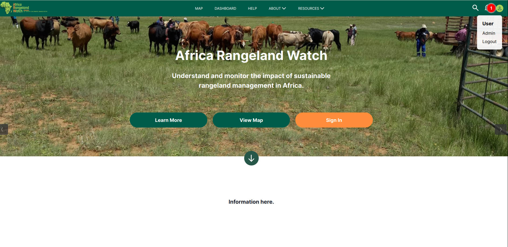

# User Manual: User Profile on Africa RangeLand Watch (ARW)

1. **Profile Icon:** Click on the profile icon and select `Profile Area` option, this allows users to see their profile.

After this users will be able to access the following pages:

* [Update Profile](./update-profile.md): This page allows users to update their profile information.

* [Organisation Information](./Organisation-information.md): This page provides information about the users organisation.

* [My Dashboard](./Dashboard.md): This page provides an overview of the projects users are involved in.

* [Analysis Results](./Analysis-result.md): This page provides the results of the analysis.

* [Upload Resources](./Uploaded-resources.md): This page allows users to upload resources.

* [Support](./Support.md): This page provides information on how to get support.

* [Notification](./Notifications.md): This page provides information on how to manage notifications.

* [Sign Out](./Sign-out-user-profile.md): This option allows users to sign out of the system.