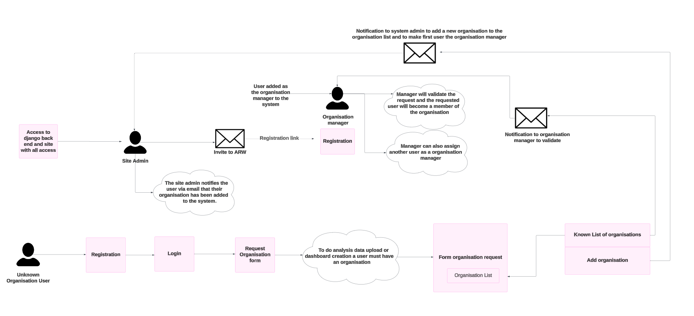

# User Workflow

## User Onboarding 1: Known organisation

### Steps to onboard a known organisation

1. **Site Admin:** The site administrator, with full access to the Django backend and the system, adds the organisation manager to the system.

2. **Email Invitation:** The site admin sends an invitation email to the organisation manager with a registration link to register on the system as an organisation manager.

3. **Organisation Manager Receives Email:** The organisation manager receives an email and can use the provided link to register on the organisation.

4. **Registration to the organisation:** Using the registration link, the organisation manager completes the registration process on the organisation.

5. **Access Granted:** The organisation manager is successfully added to the system and gains the necessary permissions to manage the organisation.

## User Onboarding 2: Unknown organisation

### Steps to onboard an unknown organisation

#### Unknown organisation user registration 

1. **Registration:** An unknown organisation user registers on the platform.

2. **Login:** The user logs into their account after successful registration.

3. **Requesting Organisation Access:** The user identifies the need to belong to an organisation for activities like data analysis, uploading data, or creating dashboards. The user submits a `Request Organisation` form to either join an existing organisation or add a new one.

    ##### Request with an existing organisation 

    1. **Select an existing organisation:** The user selects an organisation from the list of known organisations and submits the form.

    2. **Organisation Manager Approval:** The organisation manager receives a notification and approve the user's request to add user to the organisation.

    2. **Verification email:** After approval, user receives a verification email from the organisation manager.

    3. **Organisation member:** After validating the request, the requested user will become the member of the requested organisation. The manager has the ability to assign another member as the organisation manager.

    ##### Request to add a new organisation 

    1. **Add a new organisation:** Submit the request to add new organisation.

    2. **Notification email:** A notification email is sent to the system administrator to add a new organisation and designate the requested user as the organisation manager.

    ##### Admin actions

    1. **Site Admin:** The site administrator, with full access to the Django backend and the system, adds the organisation manager to the system.

    2. **Email Invitation:** The site admin sends an invitation email to the organisation manager with a registration link to register on the system as an organisation manager.

    3. **Organisation Manager Receives Email:** The organisation manager receives an email and can use the provided link to register on the organisation.

    4. **Registration to the organisation:** Using the registration link, the organisation manager completes the registration process on the organisation.

    5. **Access Granted:** The organisation manager is successfully added to the system and gains the necessary permissions to manage the organisation.

## User Onboarding 3: Invite from organisation manager

### Steps to add member to organisation

1. **Organisation Manager Sends Email Invite:** The organisation manager sends an email invite to anyone they wish to add as a member of the organisation.

2. **Organisation Member Registers:** The recipient of the email invitation registers on the platform by following the link provided.

After completing the registration, the new member logs into the organisation using their credentials.
