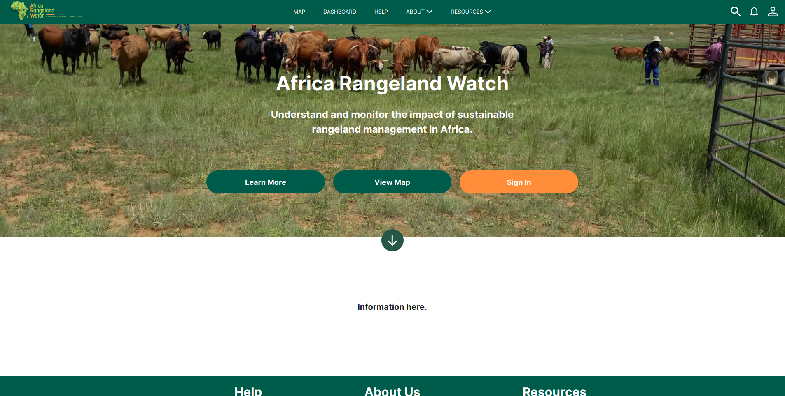
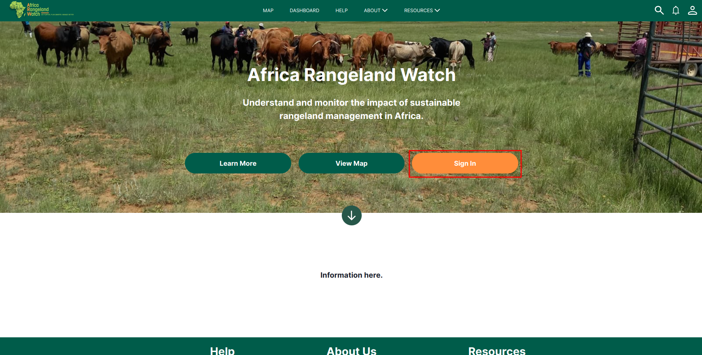
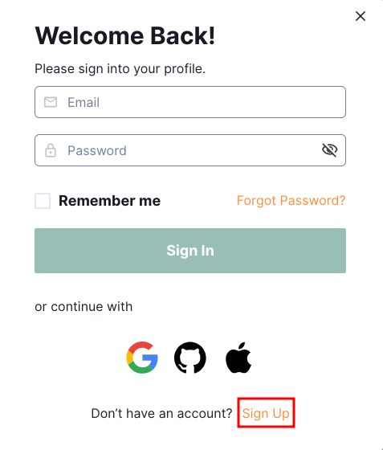
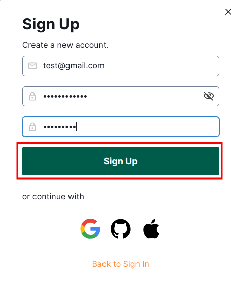
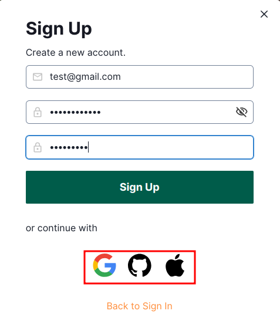
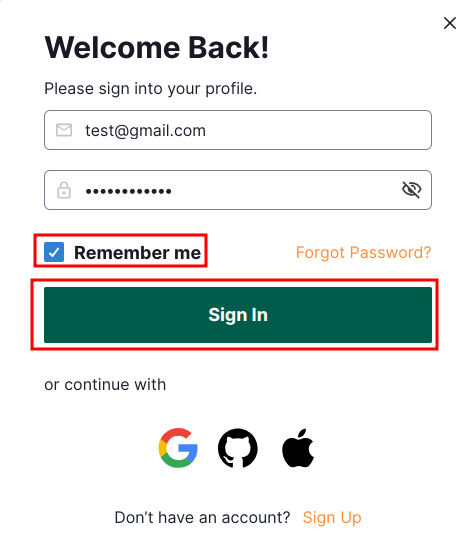
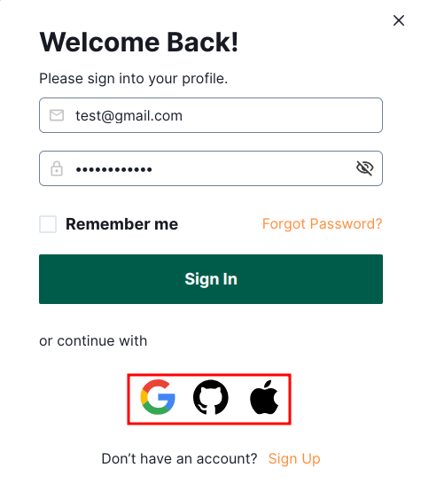
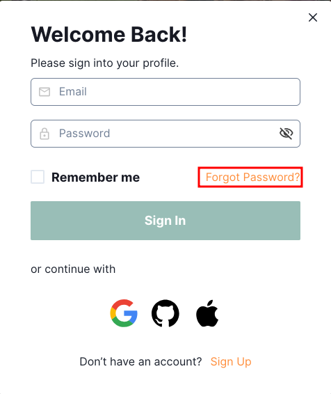
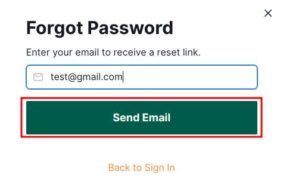

# Africa RangeLand Watch (ARW) Quickstart

## Accessing the Platform
<!-- Add link to production version of platform when available -->

Navigate to the [Home Page](https://arw.sta.do.kartoza.com/) of the site, where you will be greeted by the landing page.

## Sign Up and Signing In

Navigate to the `Sign In` button located on the homepage. Clicking this button will open a pop-up window, where you will find the option to access the sign-up page.

In this pop-up window, scroll to the bottom and locate the `Sign Up` link. Once you have found it, simply click on the link, and it will take you to the sign-up form, where you can provide the required information to create your new account.

Fill in the required details, including a valid email address and a strong password, in the sign-up form. Once you have entered the necessary information, click on the `Sign Up` button, which is located just below the form, to complete your registration process.

Alternatively, you can sign up on the ARW website using your existing Google, GitHub, or Apple account, providing a quick and seamless registration experience without the need to fill out additional forms.

## Signing In

Navigate to the homepage of the ARW website and locate the Sign In button. Once you find it, click on the button, and this action will redirect you to the sign-in page, where you can securely enter your credentials to access your account.

After the sign-in window appears, enter the email address you used during the account creation process along with the corresponding password to access your account. Once you've filled in the details, you can turn on the option to stay signed in by checking the ✅ `Remember me` box, which will keep you logged in for future visits or just simply click on the `Sign In` button to proceed and gain immediate access to your account.

Alternatively, you can streamline the sign-in process by using your existing accounts from popular platforms like Google, GitHub, or Apple. This allows you to quickly and securely log in to the ARW website without the need to remember additional passwords. Simply select your preferred account option, authenticate, and you will be granted instant access to your account, making the process much more efficient and convenient.

## Forgot Password 

In case you have forgotten your password, ARW provides a convenient option to reset it. Simply click on the `Forgot Password?` link located below the sign-in form. This will redirect you to the forgot password form.

After the `Forgot Password` form appears, enter your registered email address in the provided field and then click on the `Send Email` button to get the password reset link on your email. 

